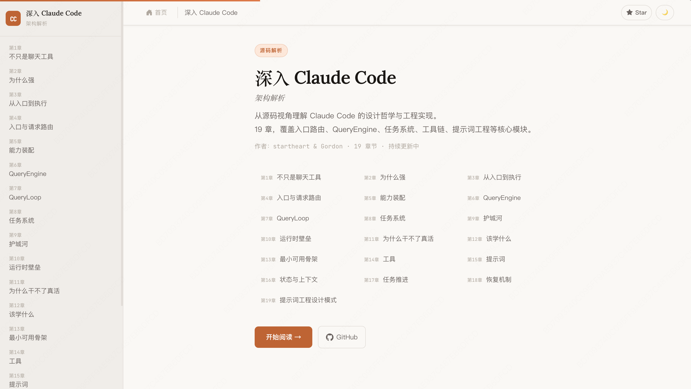

# Claude Code Recovered Source Study Repo

> 一个面向学习、评论与架构拆解的非官方整理仓库。
>
> 在线 Blog：<https://xuhengzhi75.github.io/claude-code-source/>

[](https://xuhengzhi75.github.io/claude-code-source/)

## Warning

**This repository is unofficial and is reconstructed from the public npm package and source map analysis, for research purposes only. It does not represent the original internal development repository structure.**

**本仓库为非官方整理版，基于公开 npm 发布包与 source map 分析还原，仅供研究使用。**
**不代表官方原始内部开发仓库结构。**

补充说明：
- 本仓库的恢复、整理与学习工作，参考了公开材料与研究路径。
- 其中部分情报来源与线索整理，来自 L 站用户 **“飘然与我同”** 提供的信息与启发。
- 本仓库目标是学习、评论、研究 Agent 系统设计，不主张将其误认成官方开发仓库镜像。

---

## 这是什么

这是一个围绕 **Claude Code recovered source** 整理出来的学习型仓库，重点不是“拿来直接生产运行”，而是：

1. **研究 Claude Code 这类 Coding Agent 为什么强**
2. **拆解它的运行时架构、提示词装配、工具系统、权限治理、任务系统与恢复机制**
3. **把源码阅读结果沉淀成书稿、架构笔记、证据映射与可复用写作材料**

从目录结构看，这个仓库更像一份：

- **Recovered source snapshot**
- **Architecture study workspace**
- **Book-building repo for agent system teardown**

而不是一份干净、完整、官方原始的内部工程仓库。

---

## 你可以在这里学到什么

如果你关心的是“Claude Code 为什么不像普通 LLM + 工具调用器，而更像一个成熟 Agent 平台”，这个仓库很有学习价值。

你可以重点学到：

### 1. 入口与运行模式分流
- CLI 为什么不是单一路径启动
- fast-path、daemon、background session、bridge 等模式如何共存

### 2. 能力装配与工具治理
- 命令、工具、技能、插件、MCP 工具如何形成当前会话的能力池
- 为什么真正成熟的工具系统不是函数集合，而是受治理的执行单元

### 3. 会话编排与单轮状态机的分层
- `QueryEngine` 为什么要和 `query.ts` 分开
- 会话级编排、持久化、usage/cost 与单轮执行循环如何解耦

### 4. 长流程中的恢复与连续性
- compact、resume、session memory、transcript、task recovery 如何咬合
- 为什么恢复不是“读日志再续写”，而是修复工程

### 5. 权限、安全治理与运行时边界
- 工具可见性、deny/ask/allow、permission mode、kill switch 如何共同工作
- 为什么“自动化更强”通常也意味着治理层更厚

### 6. 如何从源码中提炼 Agent 设计方法论
- 不是只看模块名，而是看控制权转移、继续/结束/恢复条件、不可删组件、边界 case、设计取舍

---

## 架构图（先看这个）

如果你想先快速建立整体感觉，可以先看这张“最小主干架构图”：

```text
用户请求 / CLI 参数
        |
        v
src/entrypoints/cli.tsx
  - fast-path 分流
  - mode 判断
  - dynamic import
        |
        v
src/main.tsx
  - 完整初始化
  - 命令/工具装配
  - 进入交互或非交互路径
        |
        v
src/commands.ts + src/tools.ts + src/Tool.ts
  - 形成当前会话可见能力池
  - 做 feature / permission / mode 过滤
        |
        v
src/QueryEngine.ts
  - submitMessage()
  - 会话编排
  - transcript / usage / result 收口
        |
        v
src/query.ts
  - 单轮状态机
  - tool_use -> tool_result -> next turn
  - compact / recovery / budget / terminal reason
        |
        +----------------------+
        |                      |
        v                      v
src/tasks/*              sessionStorage / compact / memory
  - 长任务对象化          - 连续性与恢复链
```

### 怎么理解这张图

- `cli.tsx` 决定“请求先走哪条路”
- `main.tsx` 决定“这次会话带哪些能力上路”
- `QueryEngine.ts` 决定“这次请求如何被组织成一个会话过程”
- `query.ts` 决定“这一轮怎么继续、怎么结束、怎么恢复”
- `tasks/*` 与 `sessionStorage/compact/memory` 决定“长任务和连续性如何成立”

一句话：
**这是一个“入口分流 → 能力装配 → 会话编排 → 运行时循环 → 任务与恢复”的系统，而不是一个单文件聊天程序。**

## 这个仓库怎么食用

### 快速导航（先看这 4 个入口）

- `README.md`（你正在读）
  - 先建立全局认知：仓库定位、主干架构、推荐阅读顺序
- `COMMIT-CONVENTIONS.md`
  - 再看整个仓库的统一提交规范：适用于 docs、源码注释、脚本、配置、结构整理等所有改动
- `docs/book-workspace/planning/project-status.md`
  - 再看当前进度：做到哪、缺什么、下一步优先级
- `docs/book-workspace/workflow/WORKING-METHOD.md`
  - 最后看协作与方法：阅读铁律、写作规则、交接与验收标准

> 想快速进入状态：按上面顺序读一遍，再进入 `docs/book/chapters/` 或 `docs/book-workspace/architecture-notes/`。

推荐按两条线使用：

### 线 A：源码阅读线
适合想看 recovered source 本身的人。

建议顺序：

1. `src/entrypoints/cli.tsx`
   - 看入口分流与 fast-path
2. `src/commands.ts`、`src/tools.ts`、`src/Tool.ts`
   - 看能力池怎么装配、过滤、治理
3. `src/QueryEngine.ts`
   - 看会话编排、持久化、对外事件整形
4. `src/query.ts`
   - 看真正的运行时状态机：tool_use、budget、compact、recovery、终态
5. `src/Task.ts`、`src/tasks.ts`、`src/tasks/*`
   - 看长任务为什么要独立建模

### 线 B：学习笔记 / 书稿线
适合想快速理解整体结构，而不是立刻扎进源码的人。

建议顺序：

1. `docs/book-workspace/planning/requirements.md`
   - 先看整套写作和研究的目标、标准、边界
2. `docs/book-workspace/planning/book-outline-v1.md`
   - 看全书结构与章节定位
3. `docs/book/chapters/`
   - 看已经整理出的章节正文
4. `docs/book-workspace/architecture-notes/`
   - 看技术底稿与源码分析笔记
5. `docs/book-workspace/references/chapter-evidence-map.md`
   - 看结论与源码锚点的对应关系
6. `docs/book-workspace/workflow/analysis-handoff-template.md`
   - 看“源码分析侧 -> 写作侧”的标准交接格式

---

## 这个仓库目前的核心内容

### 1. recovered source
重点源码包括：
- `src/entrypoints/cli.tsx`
- `src/main.tsx`
- `src/commands.ts`
- `src/tools.ts`
- `src/Tool.ts`
- `src/QueryEngine.ts`
- `src/query.ts`
- `src/Task.ts`
- `src/tasks/*`

### 2. 架构笔记
位于：`docs/book-workspace/architecture-notes/`

包括但不限于：
- system overview
- execution flow guide
- query engine and loop
- task system
- recovery and continuity
- tool system detail
- runtime structure
- bridge reading method

### 3. 章节书稿
位于：`docs/book/chapters/`

当前已在持续推进，目标是把源码理解沉淀成一套人人看得懂的 Claude Code 架构拆解书稿。

### 4. 证据与交接资产
- `docs/book-workspace/references/chapter-evidence-map.md`
- `docs/book-workspace/workflow/analysis-handoff-template.md`
- `docs/book-workspace/planning/collab-split.md`

这些文件的作用是：
- 避免写作漂移
- 避免源码分析与正文写作重复作业
- 让协作者能按统一接口交接

---

## 这个仓库是怎么恢复出来的

目前可公开、可保守表述的说法是：

- 恢复基础来自 **公开 npm 发布包**
- 关键结构与源码细节的补全，来自 **source map 分析**
- 在此基础上，进行了**学习型整理、架构拆解与文档化沉淀**

更准确地说，这不是“拿到官方源仓库”，而是：

> **基于公开分发产物进行结构恢复、源码还原、架构逆向与学习整理。**

因此你在这里看到的目录结构、注释状态、文件组织方式，**更接近恢复后的研究工作区，而不是官方内部开发仓库的原始样貌。**

---

## 使用时要注意什么

1. **不要把它当官方源仓库镜像**
   - 它是 recovered / reconstructed source

2. **不要默认所有目录结构都等价于官方内部工程结构**
   - 恢复过程本身会影响呈现方式

3. **不要把研究性推断写成已证实事实**
   - 仓库内部已经采用 `verified / inference` 区分机制，建议继续保持

4. **不要只看模块名，要看控制权链路和状态转移**
   - 这是读这类大型 Agent 代码最重要的方法

5. **不要只学“它有什么”，更要学“它为什么必须这样设计”**
   - 真正的价值在系统取舍，而不是功能清单

---

## 推荐阅读方法（很重要）

后续阅读这个仓库时，建议优先按这套方法：

1. **先找总判断**：这套系统真正强在哪？
2. **再看控制权链路**：谁调用谁、谁把控制权交给谁？
3. **再看能力边界**：这次会话到底开放了什么能力？
4. **再看主循环**：何时继续、何时结束、何时恢复？
5. **最后看边界 case**：哪里最容易断、为什么要这么补？

如果只按目录树顺序看，通常会得到“模块很多”；
如果按控制权、状态机和边界条件看，才更容易得到“为什么它这么强”。

---

## 免责声明

- 本仓库为非官方学习研究仓库，不代表 Anthropic 官方立场。
- 本仓库不保证与官方内部开发仓库一一对应。
- 仓库中的判断、章节、架构笔记，分为：
  - **源码可直接验证的事实**
  - **基于结构做出的保守推断**
- 读者在引用本仓库内容时，建议保留这种边界意识，而不是把所有结论都视为官方已确认事实。

---

## 如果你想继续深入

推荐继续看：

- `docs/architecture.md`
- `docs/book-workspace/architecture-notes/bridge-reading-method.md`
- `docs/book-workspace/architecture-notes/runtime-structure.md`
- `docs/book-workspace/architecture-notes/tool-system-detail.md`
- `docs/book/chapter-evidence-map.md`

如果你想进一步研究“为什么成熟 Agent 产品比普通 LLM 工具调用器更稳定”，这个仓库很适合作为一个长期拆解样本。