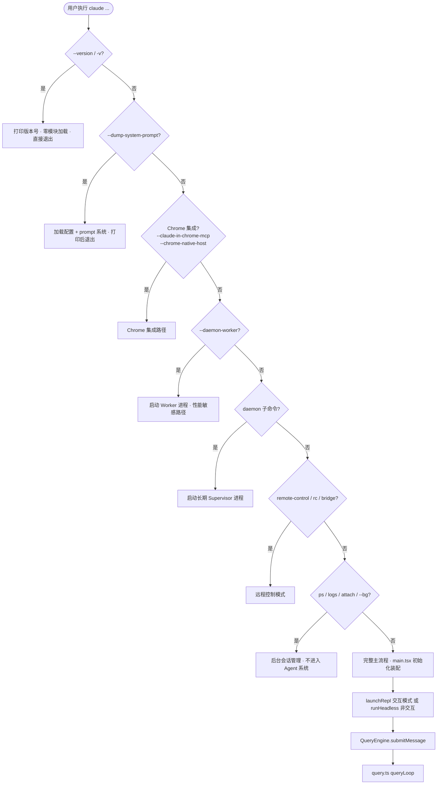

# 第3章 从入口到执行：Claude Code 主干是怎么跑起来的

## 3.1 `--version` 有多快

运行 `claude --version`，你会立刻看到版本号。

这不是因为 Claude Code 启动很快，而是因为它根本没有启动。[`cli.tsx#L40`](https://github.com/xuhengzhi75/claude-code-source/blob/c68ee10/src/entrypoints/cli.tsx#L40) 的注释写得很直白：

```typescript
// Fast-path for --version/-v: zero module loading needed
if (args.length === 1 && (args[0] === '--version' || args[0] === '-v')) {
  console.log(`${MACRO.VERSION} (Claude Code)`)
  return
}
```

`MACRO.VERSION` 是构建时内联的常量，不是运行时读取的。这个分支执行完，进程就退出了，没有加载任何其他模块。

对比一下：如果 `--version` 走完整启动流程，需要初始化配置系统、加载插件列表、建立 GrowthBook 连接……用户等待的时间会从毫秒变成秒级。

这是 `cli.tsx` 整个设计的缩影：在加载任何东西之前，先判断这次请求需要什么。

## 3.2 路由树的结构

`cli.tsx` 的 `main()` 函数是一棵 if-else 路由树，从上到下依次检查：



每条路径只加载自己需要的模块，用 `await import(...)` 动态加载，不走这条路径就不加载。

## 3.3 一个顺序不能错的细节

路由树里有一个约束，注释写得很清楚：[`cli.tsx#L99`](https://github.com/xuhengzhi75/claude-code-source/blob/c68ee10/src/entrypoints/cli.tsx#L99)

```typescript
// Fast-path for `--daemon-worker=<kind>` (internal — supervisor spawns this).
// Must come before the daemon subcommand check: spawned per-worker, so
// perf-sensitive.
if (feature('DAEMON') && args[0] === '--daemon-worker') { ... }

// Fast-path for `claude daemon [subcommand]`: long-running supervisor.
if (feature('DAEMON') && args[0] === 'daemon') { ... }
```

`--daemon-worker` 的检查必须在 `daemon` 之前。原因是：`--daemon-worker` 是 supervisor 内部生成的参数，用来启动每个 worker 进程。如果顺序反了，worker 进程启动时会先命中 `daemon` 分支，被当成 supervisor 来处理，整个 daemon 系统就乱了。

路由树的分支顺序不是随意的，每个分支的位置都有对应的约束。改动路由逻辑时，需要理解每个分支存在的原因。

## 3.4 `feature()` 为什么必须内联

路由树里到处都是 `feature('DAEMON')`、`feature('BRIDGE_MODE')` 这样的检查。注释解释了为什么这些调用不能提取成变量：

```typescript
// feature() must stay inline for build-time dead code elimination
if (feature('BRIDGE_MODE') && ...) { ... }
```

`feature()` 是构建时的开关，不是运行时的。如果某个 feature 在构建时被关闭，编译器会把整个 `if` 块连同里面的 `import` 一起删掉，最终产物里不会有这段代码。

如果把 `feature('BRIDGE_MODE')` 提取成 `const bridgeEnabled = feature('BRIDGE_MODE')`，编译器就无法确定这个变量在 `if` 里的值，死代码消除就失效了，被关闭的功能代码仍然会出现在产物里。

这是一个"代码看起来可以重构，但重构会破坏构建优化"的典型案例。

## 3.5 进入完整主流程之后

没有命中任何 fast-path 的请求，进入完整主流程：

`main.tsx` 完成初始化（配置、认证、插件加载）和装配（工具列表、命令列表、权限系统），然后根据模式分流：交互模式走 `launchRepl`，非交互模式走 `runHeadless`。

两条路最终都会到 [`QueryEngine.ts#L213`](https://github.com/xuhengzhi75/claude-code-source/blob/c68ee10/src/QueryEngine.ts#L213) 的 `submitMessage()`，再进入 [`query.ts#L243`](https://github.com/xuhengzhi75/claude-code-source/blob/c68ee10/src/query.ts#L243) 的 `queryLoop()`。

`queryLoop()` 是系统的核心循环：调用模型 → 执行工具 → 决定继续或收尾，反复迭代直到任务完成。这部分在第 7 章详细展开。

## 3.6 职责边界

整条主干的职责分工：`cli.tsx` 负责路由，不做业务；`main.tsx` 负责装配，不做执行；`QueryEngine.ts` 负责会话编排，不做循环推进；`query.ts` 负责循环推进，不做会话管理。

这种分工让每一层可以独立修改。改路由逻辑不需要理解执行循环，改执行循环不需要理解会话管理。代价是层与层之间的接口需要保持稳定，接口一旦变化，两层都要改。

## 3.7 验证题

用户运行 `claude ps` 查看后台任务列表，这个请求会走到 `queryLoop()` 吗？

答案：不会。`claude ps` 命中了 [`cli.tsx#L189`](https://github.com/xuhengzhi75/claude-code-source/blob/c68ee10/src/entrypoints/cli.tsx#L189) 的 fast-path，直接处理后返回，不进入完整主流程，更不会进入 `queryLoop()`。整个过程不需要初始化 Agent 系统、不需要加载工具列表、不需要建立 API 连接。

## 3.8 本章小结

Claude Code 的入口是一棵路由树，在加载任何业务模块之前先判断请求类型。`--version` 真正做到零模块加载，`claude ps` 不需要初始化 Agent 系统。路由树的分支顺序有约束（`--daemon-worker` 必须在 `daemon` 之前），`feature()` 必须内联以支持构建时死代码消除。

路由在最前面，每条路径只为自己的需求付出成本。这个原则不只适用于 CLI，适用于任何需要快速响应的系统入口。
