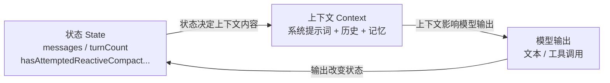
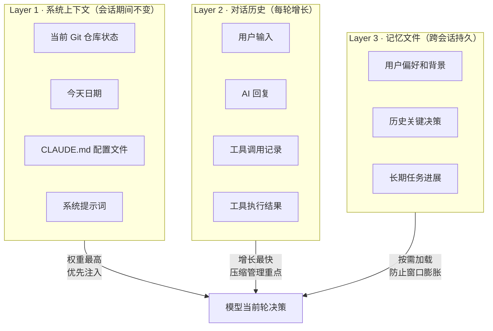

# 第16章 状态与上下文

Agent 和普通脚本最大的区别不是能调用工具，而是需要在多轮执行中维持状态。而"状态"和"上下文"是两个不同的概念，混淆它们会导致系统在中断恢复时行为不可预测。

状态是系统在某个时刻的内部情况：当前会话是否活跃、正在执行哪个任务、上一轮工具调用的结果是什么。状态是系统自己维护的，用户通常看不到。

上下文是模型在当前轮次能看到的信息：历史对话、工具调用记录、系统提示词、当前任务指令。上下文是给模型看的，决定模型在这一轮能做出什么决策。

两者的关系是：状态决定上下文的内容，上下文影响模型的输出，模型的输出改变状态。这个循环在每一轮执行中重复。



## 16.1 集中状态对象的设计

[`src/query.ts#L282`](https://github.com/xuhengzhi75/claude-code-source/blob/c68ee10/src/query.ts#L282) 的 `queryLoop()` 初始化了一个 `State` 对象，把所有跨迭代的可变状态集中在一处：`messages`、`toolUseContext`、`maxOutputTokensOverride`、`hasAttemptedReactiveCompact`、`turnCount` 等。

注释里解释了为什么要用单一对象而不是多个局部变量：每个恢复/继续分支可以原子替换所有循环变量，避免新增字段时遗漏更新。这是一个反直觉的设计选择——通常我们会认为局部变量更清晰，但在有多个恢复路径的系统里，集中状态对象让每个恢复路径都能"整体替换状态再继续"，而不是在局部变量里打补丁。

集中状态对象的问题是：随着系统演进，`State` 对象可能越来越大，包含越来越多的字段。如果不定期清理，`State` 会变成一个"什么都往里放"的垃圾桶，失去集中管理的意义。这类膨胀是渐进的，每次加字段都有充分理由，但积累到一定程度就需要一次专项整理。

## 16.2 上下文窗口的限制

模型能处理的上下文长度是有限的。[`src/query.ts#L1089`](https://github.com/xuhengzhi75/claude-code-source/blob/c68ee10/src/query.ts#L1089) 的 `hasAttemptedReactiveCompact` flag 防止了压缩触发无限循环：如果压缩后仍然过长，不会再次触发压缩，而是让错误浮出水面。

被动等待的问题是：当 API 报 context window exceeded 时，当前轮次的工作已经失败，需要从上一个检查点恢复。如果没有检查点，就需要从头开始。主动管理需要知道两个数字：当前 token 使用量和触发压缩的阈值。当前使用量从 API 响应里提取，阈值根据模型的上下文窗口大小设定。

主动管理假设 token 使用量可以从 API 响应里准确获取。如果 API 返回的 token 计数不准确（比如流式响应中途的计数），主动管理可能触发太早或太晚。

## 16.3 会话记忆的作用

[`src/services/SessionMemory/sessionMemory.ts`](https://github.com/xuhengzhi75/claude-code-source/blob/c68ee10/src/services/SessionMemory/sessionMemory.ts) 管理跨会话的长期记忆。当对话积累到一定长度，系统会提取关键信息存入 memory 文件，下次会话开始时加载。

这解决了一个实际问题：用户今天告诉 Agent 某个偏好或背景信息，明天开新会话时 Agent 还记得。没有长期记忆，每次会话都要重新建立上下文，用户体验很差。

记忆更新用受限子代理执行，[`sessionMemory.ts#L460`](https://github.com/xuhengzhi75/claude-code-source/blob/c68ee10/src/services/SessionMemory/sessionMemory.ts#L460) 的 `createMemoryFileCanUseTool()` 只允许 Edit 操作且只允许访问特定 memory 文件。这个隔离设计防止了记忆更新操作意外影响当前执行流程。

## 16.4 上下文的三层结构

每一轮执行开始时，`QueryEngine` 会组装当前轮次的上下文。上下文不是把所有信息平铺进去，而是有层次的。



第一层是系统上下文，一启动就注入，整个会话期间不变：当前 Git 仓库状态、今天的日期、用户的 CLAUDE.md 配置文件内容。来自 `context.ts` 的 `getSystemContext()` 和 `getUserContext()` 都用了 `memoize`（缓存）：这些上下文只计算一次，之后直接从缓存取，节省 Token 和计算时间。

第二层是对话历史，每一轮用户输入、AI 回复、工具调用结果都在这里。这部分增长最快，对话越长占用越多。

第三层是记忆文件，把重要信息存到文件里，需要时再读取。这是 Claude Code 跨会话保留信息的机制。

这些内容的顺序和格式对模型的行为有影响。系统提示词在最前面，权重最高；最近的对话在最后面，模型对近期内容的注意力更强。

对业务 Agent 来说，上下文管理的关键决策是：哪些历史信息需要保留，哪些可以压缩或丢弃。保留太多会撑满上下文窗口，保留太少会让模型失去必要的背景。Claude Code 的压缩策略是保留关键摘要和最近的对话，丢弃中间的细节（[`compact.ts#L328`](https://github.com/xuhengzhi75/claude-code-source/blob/f82ac18334ec9ca9890b9294ea8efa72773fa97c/src/services/compact/compact.ts#L328)）。

## 16.4.1 历史记录系统

Claude Code 还有一套提示词历史系统，记录用户打过的指令，支持上下键翻历史或搜索历史命令。来自 `history.ts`：

```typescript
const MAX_HISTORY_ITEMS = 100  // 最多记录100条历史

// 历史写入是异步批量的：先缓存到内存，定期刷盘
// 好处：用户操作不卡顿；偶尔断电可能丢几条记录，但影响不大
export function addToHistory(command: HistoryEntry | string): void {
  // 如果是由 Claude 自动创建的验证/测试会话，跳过历史记录
  // 避免污染用户的真实命令历史
  if (isEnvTruthy(process.env.CLAUDE_CODE_SKIP_PROMPT_HISTORY)) {
    return
  }
  void addToPromptHistory(command)
}
```

历史记录按项目隔离，当前会话的记录优先显示，多个并行会话不会互相干扰。

对于大文本的处理：如果粘贴了超大段代码，历史系统不会存储全文，而是小于 1024 字节直接存原文，大于 1024 字节存 Hash 值，原文另存到 `paste-store`。这样历史文件不会因为大量粘贴内容而膨胀。这个模式值得借鉴：对大内容做摘要或哈希，只在需要时还原，是控制存储膨胀的通用手段。

## 16.5 状态持久化

[`QueryEngine.ts#L443`](https://github.com/xuhengzhi75/claude-code-source/blob/c68ee10/src/QueryEngine.ts#L443) 在进入主循环之前，先把用户输入写入 transcript。这个操作保证了即使进程在执行中途崩溃，已提交的输入不会丢失。

状态持久化的原则是：在开始执行之前落盘，而不是执行完成后落盘。如果执行完成后才落盘，中途崩溃就会导致状态丢失，下次恢复时不知道上次执行到哪里。

## 16.6 心智模型验证题

如果把 `State` 对象里的字段改成多个局部变量，在什么情况下会出现问题？

答案：在有多个恢复路径的情况下。比如，当上下文过长时，系统需要触发压缩并重试。如果状态是多个局部变量，恢复路径需要逐个修改每个变量，容易遗漏某个变量。如果状态是集中对象，恢复路径可以整体替换状态，不会遗漏。随着恢复路径数量增加，这个问题会越来越明显。

## 16.7 本章小结

状态是系统内部情况，上下文是模型能看到的信息。[`query.ts#L282`](https://github.com/xuhengzhi75/claude-code-source/blob/c68ee10/src/query.ts#L282) 的集中 `State` 对象让恢复路径可以原子替换状态，而不是在局部变量里打补丁。上下文窗口需要主动监控和压缩，长期记忆通过隔离的子代理更新（[`sessionMemory.ts#L460`](https://github.com/xuhengzhi75/claude-code-source/blob/f82ac18334ec9ca9890b9294ea8efa72773fa97c/src/services/SessionMemory/sessionMemory.ts#L460)）。状态持久化要在执行开始前落盘（[`QueryEngine.ts#L443`](https://github.com/xuhengzhi75/claude-code-source/blob/f82ac18334ec9ca9890b9294ea8efa72773fa97c/src/QueryEngine.ts#L443)），不要等执行完成后。

状态和上下文是两件事。搞清楚这个区别，是设计可恢复 Agent 的第一步。
