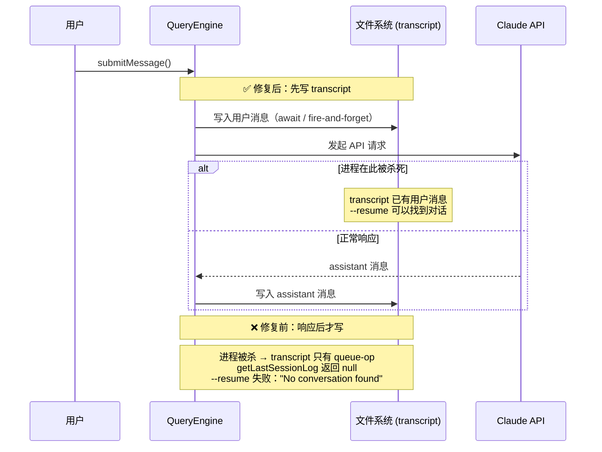

# 第1章 Claude Code 不只是聊天工具

一个进程被杀死，重启后从被杀死的位置继续——这件事取决于什么？

不取决于模型有多聪明。取决于进程死之前写下了什么。煤气罐爆炸之前，值班员把当前阀门状态写进了本子——这本子是恢复能力的物理载体。系统崩溃时，能恢复多少，由"写了什么"和"什么时候写的"决定。

把这个逻辑推到工程实践：Agent 的实际能力是模型能力和系统组织能力的乘积。系统组织能力为零，模型再强也没用。Claude Code 和普通聊天工具的根本差距在系统层，不在模型层。

三个具体的设计决策承载这个主张：写入时序、存储格式、继续条件。每一个决策都有源码为证，每一个决策的反面都有可预测的失败路径。

---

## 1.1 写入时序决定恢复能力的边界

恢复能力不是独立功能，是写入时序约束的结果。`QueryEngine.ts#L443` 规定：用户消息在 API 调用发起之前写入 transcript（持久化到磁盘的对话记录文件），不是之后。

注释把颠倒顺序的失败路径写得清楚：

```typescript
// Persist the user's message(s) to transcript BEFORE entering the query
// loop. The for-await below only calls recordTranscript when ask() yields
// an assistant/user/compact_boundary message — which doesn't happen until
// the API responds. If the process is killed before that (e.g. user clicks
// Stop in cowork seconds after send), the transcript is left with only
// queue-operation entries; getLastSessionLog filters those out, returns
// null, and --resume fails with "No conversation found". Writing now makes
// the transcript resumable from the point the user message was accepted,
// even if no API response ever arrives.
```

用户发消息，进程在 API 响应到来之前被杀死。若写入发生在响应之后，transcript 里只有 `queue-operation`（任务队列操作记录）条目。`getLastSessionLog` 在 `messages.size === 0` 时返回 null（`sessionStorage.ts#L3890`），`--resume` 提示"No conversation found"——没有报错，没有警告，静默失败。

写入移到 API 调用之前，代码位置移动一行，恢复语义从根本改变。进程在任意时刻被杀，下次 `--resume` 都能找到最后一条用户消息作为起点。



提前写入有代价。同一注释记录了实测延迟：SSD 上约 4ms，磁盘竞争时约 30ms，是整条启动路径上最大的可控延迟。

bare 模式（通过 `--bare` 或 `SIMPLE` 环境变量启用的脚本调用模式）下，写入改为 fire-and-forget：

```typescript
if (isBareMode()) {
  void transcriptPromise  // 不等待
} else {
  await transcriptPromise  // 交互模式等待完成
}
```

脚本调用不需要 `--resume`，可以接受写入失败的概率；交互模式必须确保写入完成。bare 模式下磁盘写满或进程被信号杀死时，transcript 可能不完整，失败只在下次 `--resume` 时才暴露，写入时不会报错。

---

## 1.2 JSONL 的 append-only 格式让崩溃不损坏数据，但引入不可删除约束

Claude Code 用文件系统存 transcript。`sessionStorage.ts#L204` 的 `getTranscriptPath()` 返回 `<sessionId>.jsonl`，普通文本文件，每条消息独立追加到文件末尾。

JSONL（逐行 JSON，每行一个独立 JSON 对象）的关键属性：每次写入是原子的单行 append。进程在任意时刻被杀，已写入的行是完整可解析的。单个 JSON 文件要重写整个文件才能追加，进程被杀会留下损坏的 JSON；JSONL 不会。

`sessionStorage.ts#L1963` 的注释固化了一个设计约束："The JSONL is append-only, so removed messages stay on disk"。删除消息不会修改磁盘内容，只在内存中过滤。这是格式选择带来的约束，不是实现疏漏。

文件系统替代数据库，在单机工具上零依赖是优势。这个选择带来两笔账。

`sessionStorage.ts#L225-L227` 定义了 `MAX_TRANSCRIPT_READ_BYTES = 50 * 1024 * 1024`，注释说"session JSONL can grow to multiple GB (inc-3930)"。超过 50MB 时只扫描最后 50MB，极长会话的早期历史在 `--resume` 时会被截断。这写进了设计约束里，不是边界情况。

`sessionStorage.ts#L3621-L3626` 记录了格式演进的后果。PR #24099 把 `progress` 消息从 `isTranscriptMessage` 里移除，但旧 JSONL 文件里仍有这些条目。`loadTranscriptFile` 有专门的 `progressBridge` 逻辑处理遗留条目，防止 `buildConversationChain` 在遇到 progress 的 `parentUuid` 时截断链。用文件系统存数据，不能做 schema migration，只能在读取时处理所有历史格式。

`--resume` 静默失败的精确路径在 `sessionStorage.ts#L139-L146`：`isTranscriptMessage` 只允许 type 为 `user`/`assistant`/`attachment`/`system` 的条目进入 `messages` Map。`queue-operation` 类型写入 JSONL，但读取时被静默跳过。`getLastSessionLog` 在 `messages.size === 0` 时返回 null（`L3890`），不说会话里没有对话消息，只说找不到会话。

`L3891-L3901` 在 `--resume` 路径上有缓存预热：加载完 session 文件后，如果 `getSessionMessages` 缓存为空，就把 UUID 集合写入缓存，节省后续 `recordTranscript` 的重复读取。注释说节省了 170-227ms，是实测数据。

---

## 1.3 继续条件看工具调用事实，消除模型声明过早结束的错误

`query.ts#L561` 的判断逻辑不看 `stop_reason`，看上一轮（turn，从用户发消息到 AI 回复完毕算一个 turn）有没有 `tool_use` 块。有工具调用就继续，没有才考虑停止。

模型返回 `stop_reason: end_turn` 就停止，这个逻辑的漏洞是模型可能在任务没完成时就声明结束，因为它不知道自己还需要继续。工具调用是客观发生的事实，模型声明是主观判断。基于事实判断替代基于声明判断，消除了一类错误：模型过早声明完成，但实际上还有工具调用需要执行。

---

## 可迁移原则

写入发生在哪一步，系统就能从哪一步恢复。

这个原则适用于任何需要中断恢复的系统：写 WAL（预写日志）的数据库、记录检查点的批处理任务、带草稿自动保存的编辑器。反例：如果操作本身不可分割，或中间状态没有意义（如网络请求的部分响应），提前写入引入不必要的复杂性，得不到对应的恢复收益。文件系统替代数据库在单机场景零依赖是优势，需要多机协作时文件系统成瓶颈。

原则是工具，不是教条。
