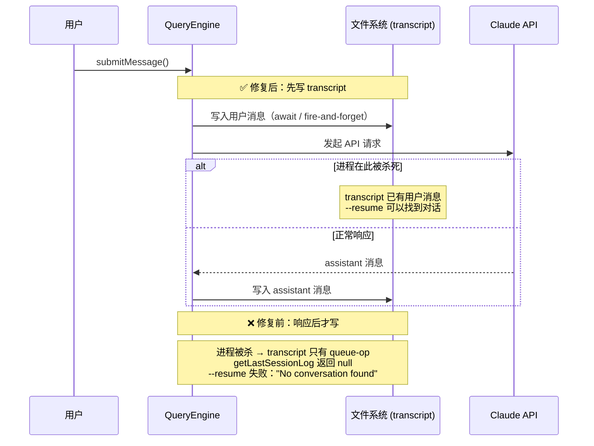

# 第1章 Claude Code 不只是聊天工具

一个程序在任意时刻被杀死，重启后能从被杀死的位置继续，这件事需要什么？不需要特别聪明的模型，需要系统在进程死之前写下了足够多的东西。Claude Code 和聊天工具的差距在这里，不在模型层。

## 1.1 先写文件，崩溃后才能恢复

Claude Code 的恢复能力依赖一个具体的时序约束：用户消息在 API 调用发起之前写入 transcript（持久化的消息历史文件），不是之后。

[`QueryEngine.ts#L443`](https://github.com/xuhengzhi75/claude-code-source/blob/c68ee10/src/QueryEngine.ts#L443) 的注释记录了这个约束被打破时的完整失败路径：

```typescript
// Persist the user's message(s) to transcript BEFORE entering the query
// loop. The for-await below only calls recordTranscript when ask() yields
// an assistant/user/compact_boundary message — which doesn't happen until
// the API responds. If the process is killed before that (e.g. user clicks
// Stop in cowork seconds after send), the transcript is left with only
// queue-operation entries; getLastSessionLog filters those out, returns
// null, and --resume fails with "No conversation found". Writing now makes
// the transcript resumable from the point the user message was accepted,
// even if no API response ever arrives.
```

用户发消息，进程在 API 响应到来之前被杀死。如果写入发生在响应之后，transcript 里只有 `queue-operation`（任务队列操作记录）条目，没有 user/assistant 消息。`getLastSessionLog` 过滤掉这些条目后返回 null，`--resume` 提示"No conversation found"，没有报错，没有警告。

把写入移到 API 调用之前，代码位置移动一行，恢复语义从根本改变。进程在任意时刻被杀，下次 `--resume` 都能找到最后一条用户消息作为起点。



### 4ms 写盘，这个代价可以接受

提前写入有代价。同一注释记录了实测延迟：SSD 上约 4ms，磁盘竞争时约 30ms，是整个启动路径上最大的可控延迟。

bare 模式（通过 `--bare` 或 `SIMPLE` 环境变量启用的脚本调用模式）下，写入改为 fire-and-forget：

```typescript
if (isBareMode()) {
  void transcriptPromise  // 不等待
} else {
  await transcriptPromise  // 交互模式等待完成
}
```

脚本调用不需要 `--resume`，可以接受写入失败的概率；交互模式必须确保写入完成。同一个操作，两种等待策略，对应两种使用场景。

bare 模式下如果磁盘写满或进程被信号杀死，transcript 可能不完整，失败只在下次 `--resume` 时才暴露，写入时不会报错。

## 1.2 格式选对了，中断不会损坏数据

Claude Code 用文件系统存 transcript。[`sessionStorage.ts#L204`](https://github.com/xuhengzhi75/claude-code-source/blob/main/src/utils/sessionStorage.ts#L204) 的 `getTranscriptPath()` 返回 `<sessionId>.jsonl`，普通文本文件，每条消息独立追加到文件末尾。

JSONL（逐行 JSON，每行一个独立 JSON 对象）的关键属性是每次写入都是原子的单行 append。进程在任意时刻被杀，已写入的行是完整可解析的。单个 JSON 文件要重写整个文件才能追加，进程被杀会留下损坏的 JSON；JSONL 不会。

[`sessionStorage.ts#L1963`](https://github.com/xuhengzhi75/claude-code-source/blob/main/src/utils/sessionStorage.ts#L1963) 的注释明确了一个设计约束："The JSONL is append-only, so removed messages stay on disk"。删除消息不会修改磁盘内容，只在内存中过滤。这是格式选择带来的约束，不是实现疏漏。

### 用文件存数据，得承受这些代价

[`sessionStorage.ts#L225-L227`](https://github.com/xuhengzhi75/claude-code-source/blob/main/src/utils/sessionStorage.ts#L225) 有一处细节：`MAX_TRANSCRIPT_READ_BYTES = 50 * 1024 * 1024`（50MB），注释说"session JSONL can grow to multiple GB (inc-3930)"。超过 50MB 时只扫描最后 50MB，极长会话的早期历史在 `--resume` 时会被截断。这写进了设计约束里，不是边界情况。

[`sessionStorage.ts#L3621-L3626`](https://github.com/xuhengzhi75/claude-code-source/blob/main/src/utils/sessionStorage.ts#L3621) 的注释记录了一处格式演进：PR #24099 把 `progress` 消息从 `isTranscriptMessage` 里移除，但旧 JSONL 文件里仍然有这些条目。`loadTranscriptFile` 有专门的 `progressBridge` 逻辑处理遗留条目，防止 `buildConversationChain` 在遇到 progress 的 `parentUuid` 时截断链。用文件系统存数据，不能做 schema migration，只能在读取时处理所有历史格式。

### `--resume` 为什么会静默失败

[`sessionStorage.ts#L139-L146`](https://github.com/xuhengzhi75/claude-code-source/blob/main/src/utils/sessionStorage.ts#L139) 定义了 `isTranscriptMessage`：只有 type 为 `user`/`assistant`/`attachment`/`system` 的条目才算消息。`queue-operation` 类型写入 JSONL，但读取时被静默跳过，不进入 `messages` Map。

`getLastSessionLog` 返回 null 的精确路径是 `messages.size === 0`（[`L3890`](https://github.com/xuhengzhi75/claude-code-source/blob/main/src/utils/sessionStorage.ts#L3890)）：

```
getLastSessionLog(sessionId)
  → loadSessionFile → loadTranscriptFile
    → 每行：if isTranscriptMessage(entry) → messages.set(uuid, entry)
    → queue-operation 不满足 → 被跳过
  → if messages.size === 0 → return null
```

JSONL 里有内容但 `--resume` 失败的场景：文件里只有任务队列操作记录，没有 user/assistant 消息，`messages.size === 0`，返回 null。报错只说找不到会话，不说会话里没有对话消息。

[`L3891-L3901`](https://github.com/xuhengzhi75/claude-code-source/blob/main/src/utils/sessionStorage.ts#L3891) 在 `--resume` 路径上有缓存预热：加载完 session 文件后，如果 `getSessionMessages` 缓存为空，就把 UUID 集合写入缓存，节省后续 `recordTranscript` 的重复读取。注释说节省了 170-227ms，是实测数据。

## 1.3 继续不继续，看工具调用，不看模型说啥

聊天工具判断任务完成的方式：模型返回 `stop_reason: end_turn`，停止。这套逻辑的漏洞是模型可能在任务没完成时就返回 `end_turn`，因为它不知道自己还需要继续。

[`query.ts#L561`](https://github.com/xuhengzhi75/claude-code-source/blob/main/src/query.ts#L561) 的判断逻辑不看 `stop_reason`，看上一轮有没有 `tool_use` 块。有工具调用就继续，没有才考虑停止。

模型可能声明错，但工具调用是客观发生的。这个设计消除了一类错误：模型过早声明完成，但实际上还有工具调用需要执行。

## 1.4 系统组织能力决定 Agent 能走多远

```
Agent 实际能力 ≈ 模型能力 × 系统组织能力
```

这是乘法。系统组织能力为零，模型再强也没用。系统组织能力包含四件事：知道当前在哪里（状态管理）、知道能做什么（工具契约）、知道中断后怎么继续（恢复机制）、知道多个任务如何协调（任务系统）。聊天工具不需要这四件事，Claude Code 都需要。

这三个设计选择是系统组织能力的具体实现：先落盘再执行（[`QueryEngine.ts#L443`](https://github.com/xuhengzhi75/claude-code-source/blob/c68ee10/src/QueryEngine.ts#L443)），用 JSONL 的 append-only 原子写入（[`sessionStorage.ts#L1963`](https://github.com/xuhengzhi75/claude-code-source/blob/main/src/utils/sessionStorage.ts#L1963)），根据事实而非声明判断继续条件（[`query.ts#L561`](https://github.com/xuhengzhi75/claude-code-source/blob/main/src/query.ts#L561)）。

## 1.5 可迁移原则

持久化的时序决定恢复能力的边界。写入发生在哪一步，系统就能从哪一步恢复。

这个原则适用于任何需要中断恢复的系统：写 WAL（预写日志）的数据库、记录检查点的批处理任务、带草稿自动保存的编辑器。反例：如果操作本身不可分割，或中间状态没有意义（如网络请求的部分响应），提前写入会引入不必要的复杂性，得不到对应的恢复收益。至于文件系统代替数据库的选择，在单机工具上零依赖是优势；需要多机协作时文件系统成瓶颈。

原则是工具，不是教条。
