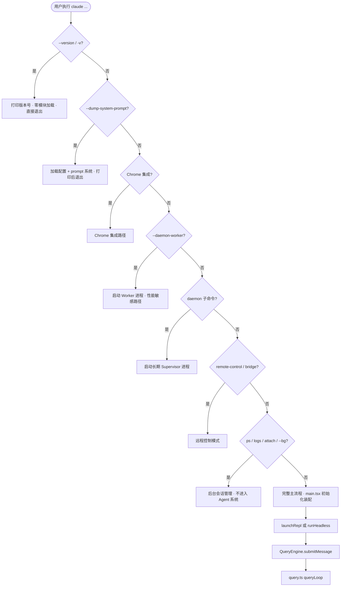

# 第3章 从入口到执行：入口层分流确保启动成本与路径职责对齐

餐厅的服务员不会让每个来问"今天有没有包间"的客人先坐下来，等上菜单、点餐、结账。问完一句话，答完一句话，走人。入口层做的事情相同：在任何重操作开始之前，先判断这条请求是否需要完整初始化。

这个直觉引出三个不那么直觉的问题：分支检查为什么不能随意调换顺序？`feature()` 调用为什么不能提取成变量？路由前置本身有什么前提条件？本章回答这三个问题。

---

## 3.1 分支越早退出，加载范围越小

`--version` 几乎瞬间返回，原因是它在任何模块加载发生之前就已经退出了。

[`cli.tsx#L40`](https://github.com/xuhengzhi75/claude-code-source/blob/c68ee10/src/entrypoints/cli.tsx#L40)：

```typescript
// Fast-path for --version/-v: zero module loading needed
if (args.length === 1 && (args[0] === '--version' || args[0] === '-v')) {
  console.log(`${MACRO.VERSION} (Claude Code)`)
  return
}
```

`MACRO.VERSION` 是构建时内联的字符串常量，不是运行时读取的。这个分支执行完，进程退出，没有配置文件读取，没有 Keychain 操作。完整主流程相比之下要初始化配置、加载插件列表、建立 GrowthBook 连接（GrowthBook：特性开关服务，用于运行时控制功能可见性），从毫秒变成秒级。

同样的逻辑适用于 `claude ps`。它命中 [`cli.tsx#L189`](https://github.com/xuhengzhi75/claude-code-source/blob/c68ee10/src/entrypoints/cli.tsx#L189) 的 fast-path，直接处理后返回，不初始化 Agent 系统，不加载工具列表，不建立 API 连接。`cli.tsx` 的 `main()` 整体是一棵从上到下的 if-else 路由树，每个分支用 `await import(...)` 动态加载当前路径需要的模块，没有命中的分支对应的模块不被加载。



没有命中任何 fast-path 的请求进入完整主流程。`main.tsx` 完成初始化和装配，然后按模式分流：交互模式走 `launchRepl`，非交互模式走 `runHeadless`，两条路都到 [`QueryEngine.ts#L213`](https://github.com/xuhengzhi75/claude-code-source/blob/c68ee10/src/QueryEngine.ts#L213) 的 `submitMessage()`，再进入 [`query.ts#L243`](https://github.com/xuhengzhi75/claude-code-source/blob/c68ee10/src/query.ts#L243) 的 `queryLoop()`。`main.tsx` 的装配细节在第4章，`queryLoop()` 的状态机逻辑在第7章，本章覆盖到"路径如何收敛到 `submitMessage()`"为止。

## 3.2 路由树的分支顺序是运行时约束，不是编码风格

[`cli.tsx#L99`](https://github.com/xuhengzhi75/claude-code-source/blob/c68ee10/src/entrypoints/cli.tsx#L99) 的注释直接说明了顺序的原因：

```typescript
// Fast-path for `--daemon-worker=<kind>` (internal — supervisor spawns this).
// Must come before the daemon subcommand check: spawned per-worker, so
// perf-sensitive.
if (feature('DAEMON') && args[0] === '--daemon-worker') { ... }

// Fast-path for `claude daemon [subcommand]`: long-running supervisor.
if (feature('DAEMON') && args[0] === 'daemon') { ... }
```

`--daemon-worker` 是 supervisor 内部生成的参数，用来启动每个 worker 进程。如果把这两个检查的顺序交换，worker 进程启动时会先命中 `daemon` 分支，被当成 supervisor 处理，整个 daemon 系统的进程身份就错了。

路由树里每个位置对应一个具体的运行时约束。注释记录的是"为什么不能改成另一种写法"，不是代码做了什么。这类注释的信息量比代码本身更高，因为代码只能表达"是什么"，注释记录的是"不这样会怎样"。

## 3.3 `feature()` 必须内联，提取成变量会破坏构建期优化

路由树里到处有 `feature('DAEMON')`、`feature('BRIDGE_MODE')` 这样的检查，没有提取成共享变量。[`cli.tsx#L114`](https://github.com/xuhengzhi75/claude-code-source/blob/c68ee10/src/entrypoints/cli.tsx#L114) 的注释：

```typescript
// feature() must stay inline for build-time dead code elimination
if (feature('BRIDGE_MODE') && ...) { ... }
```

`feature()` 是构建时开关。编译器遇到 `if (feature('BRIDGE_MODE') && ...)` 时，如果 `BRIDGE_MODE` 在构建配置里关闭，整个 `if` 块连同其中的 `import` 语句一起从产物里删除。

如果改写成 `const bridgeEnabled = feature('BRIDGE_MODE')`，再用 `if (bridgeEnabled && ...)`，编译器在静态分析阶段无法推断 `bridgeEnabled` 在这个 `if` 里的值，死代码消除失效。被关闭的功能代码仍然出现在产物里，增加包体积，并且把未发布功能的实现暴露在可访问的代码中。代码重复本身不是问题，破坏构建时约束才是。

## 3.4 路由前置的前提：轻操作在路由阶段能获得所需信息

把路由放在最前面，轻操作不为重操作付出启动成本。这个结论有一个前提：轻操作在路由阶段就能获得自己需要的全部信息。

如果轻操作需要读取某个只有在完整初始化后才存在的状态，路由前移的前提就不成立了。这时要么把所需状态提前到路由层可访问的位置，要么接受轻操作也要走完整初始化。两种方案都有代价，不存在自动成立的最优解。[inference]

原则是工具，不是教条。
