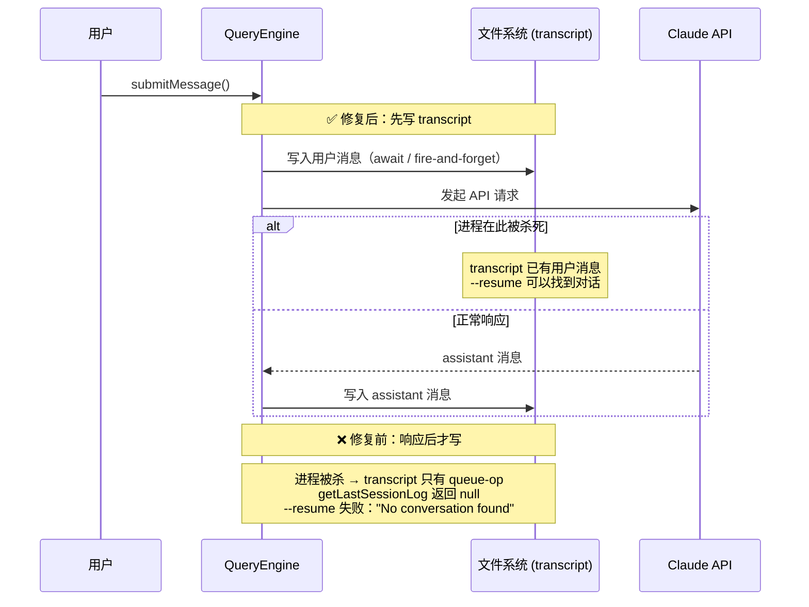
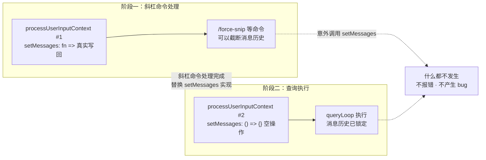

# 第6章 QueryEngine：会话编排核心

如果一个系统在崩溃后能恢复，这个能力是在哪里建立的？答案不是崩溃恢复逻辑本身，而是崩溃前"写了什么"——写了多少、写在哪一步。`QueryEngine` 把这件事固定为约束，让调用方无法绕过。

## 6.1 恢复能力依赖写入时序，顺序颠倒时恢复静默失败

`QueryEngine` 是 Claude Code 的会话编排层，负责跨多轮对话（turn，即一次用户发送到下一次用户发送的完整交互周期）的状态管理：持久化消息历史（transcript）、累计 token 用量、记录权限拒绝状态。它不执行单轮对话，这件事交给 `query.ts`。

"先持久化后执行"是 `QueryEngine` 强制的顺序。用户消息在 API 调用发起之前写入 transcript，不是之后。这个顺序的直接意义：进程在任意时刻被杀死，下次 `--resume` 都能找到最后一条用户消息作为恢复起点。

顺序颠倒时，恢复能力消失，且失败静默。用户发出消息，在 API 响应到来之前关闭终端，进程被杀。重开运行 `claude --resume`，提示"No conversation found"。没有报错，没有警告，只是找不到会话。

[`QueryEngine.ts#L443`](https://github.com/xuhengzhi75/claude-code-source/blob/c68ee10/src/QueryEngine.ts#L443) 的注释记录了这个 bug 的完整路径：

```typescript
// Persist the user's message(s) to transcript BEFORE entering the query
// loop. The for-await below only calls recordTranscript when ask() yields
// an assistant/user/compact_boundary message — which doesn't happen until
// the API responds. If the process is killed before that (e.g. user clicks
// Stop in cowork seconds after send), the transcript is left with only
// queue-operation entries; getLastSessionLog filters those out, returns
// null, and --resume fails with "No conversation found". Writing now makes
// the transcript resumable from the point the user message was accepted,
// even if no API response ever arrives.
```



原来的逻辑等 API 响应到来后才写 transcript。在"发送后、响应前"被杀死时，transcript 里只有 `queue-operation` 条目，`getLastSessionLog` 过滤这些条目后返回 null，`--resume` 失败。修复方案是把写入移到 API 调用之前。代码位置移动一行，恢复语义从根本上改变。

### 写入成本可控：4ms 是整条关键路径最大可控延迟

提前写入不是零代价。同一注释记录了延迟数据：

```typescript
// --bare / SIMPLE: fire-and-forget. Scripted calls don't --resume after
// kill-mid-request. The await is ~4ms on SSD, ~30ms under disk contention
// — the single largest controllable critical-path cost after module eval.
```

SSD 上约 4ms，磁盘竞争时约 30ms。这是整个启动路径上最大的可控延迟，但"可控"意味着可以按场景分开处理。

bare 模式（通过 `--bare` 或 `SIMPLE` 环境变量启用的脚本调用模式）下，写入改为 fire-and-forget：

```typescript
if (isBareMode()) {
  void transcriptPromise  // 不等待
} else {
  await transcriptPromise  // 交互模式等待完成
}
```

脚本调用不需要 `--resume`，可以接受写入失败的概率。交互模式必须确保写入完成才能保证恢复能力。同一个操作，两种等待策略，分别服务于两种使用场景。

bare 模式的 fire-and-forget 带来一个隐性代价：脚本调用时如果磁盘写满或进程被信号杀死，transcript 可能不完整，`--resume` 会失败，但系统不会在写入时报错。失败只在下次 `--resume` 时才暴露。

## 6.2 两阶段替换防止状态污染，不引入新的类型或状态机

`QueryEngine` 在一轮处理中创建了两个 `processUserInputContext` 对象。这不是重复，是有意的状态锁定机制。

[`QueryEngine.ts#L342`](https://github.com/xuhengzhi75/claude-code-source/blob/c68ee10/src/QueryEngine.ts#L342) 的第一个对象允许斜杠命令修改消息历史：

```typescript
// Slash commands that mutate the message array (e.g. /force-snip)
// call setMessages(fn). In interactive mode this writes back to
// AppState; in print mode we write back to mutableMessages so the
// rest of the query loop sees the result. The second
// processUserInputContext below (after slash-command processing)
// keeps the no-op — nothing else calls setMessages past that point.
setMessages: fn => {
  this.mutableMessages = fn(this.mutableMessages)
},
```

`/force-snip` 需要截断消息历史，这个 `setMessages` 回调让它能做到。斜杠命令处理完成后，第二个对象把 `setMessages` 替换成空操作：

```typescript
setMessages: () => {},  // 锁定，不再允许修改
```



这个替换的意义：如果查询执行阶段的任何代码意外调用 `setMessages`，什么都不发生，不产生 bug，也不报错。状态被锁定，不是通过增加校验逻辑，而是通过把"能做事的实现"换成"什么都不做的实现"。

这个模式有一个前提假设：斜杠命令处理和查询执行是严格顺序的，不会并发。如果未来引入并发斜杠命令处理，这套两阶段替换需要重新设计。[inference]

### turn 级状态与会话级状态的区分是隐式约定

`QueryEngine` 内部有两类状态，区分方式目前依赖开发者记忆，没有类型级约束。

`mutableMessages`（[`QueryEngine.ts#L190`](https://github.com/xuhengzhi75/claude-code-source/blob/c68ee10/src/QueryEngine.ts#L190)）、`totalUsage`（[`L193`](https://github.com/xuhengzhi75/claude-code-source/blob/c68ee10/src/QueryEngine.ts#L193)）、`permissionDenials`（[`L192`](https://github.com/xuhengzhi75/claude-code-source/blob/c68ee10/src/QueryEngine.ts#L192)）跨 turn 保留，是会话级状态。

`discoveredSkillNames`（[`QueryEngine.ts#L201`](https://github.com/xuhengzhi75/claude-code-source/blob/c68ee10/src/QueryEngine.ts#L201)）在每次 `submitMessage()` 开始时清空，是 turn 级状态。

这个区分目前是隐式的。哪些字段是会话级、哪些是 turn 级，需要读代码才能判断。新增 turn 级状态时如果忘记在 `submitMessage()` 开始处清空，上一轮的状态会污染下一轮——没有编译器检查，没有运行时错误，只有行为异常。这是当前设计的已知技术债。

## 6.3 职责分层让两层可独立推理

`QueryEngine` 管跨 turn 的状态，`query.ts` 管单轮内的执行。这条边界的价值不是"结构更清晰"，而是两层可以独立修改、独立测试。

`query.ts` 的状态机（`State`）决定当前轮是否继续（基于 `tool_use` 是否出现）、上下文过长时怎么处理。它不知道消息来自 CLI 还是 API，不知道会话已经进行了几轮，不知道 token 累计用量。这些都在 `QueryEngine` 层。

新接入层（SDK、REPL、远程调用）时，只需要在 `QueryEngine` 层做协议适配，`query.ts` 的状态机逻辑不用动。`query.ts` 的测试不需要构造完整的会话上下文，只需要构造单轮输入。

`query.ts` 的状态机结构和四条恢复路径在第7章展开。transcript 的 JSONL 格式、append-only 约束、50MB 读取上限和历史格式迁移逻辑在第1章和第16章。权限拒绝记录（`permissionDenials`）的处理机制在权限系统章节。

## 6.4 可迁移原则

持久化的时序决定恢复能力的边界。写入发生在哪一步，系统就能从哪一步恢复。

这个原则适用于任何需要中断恢复的系统：写 WAL（预写日志）的数据库、记录检查点的批处理任务、带草稿自动保存的编辑器。反例：如果操作本身不可分割（如原子性数据库事务），或者操作完成前的中间状态没有意义（如网络请求的部分响应），提前写入会引入不必要的复杂性，得不到对应的恢复收益。

原则是工具，不是教条。

---

验证题：把 transcript 写入从 API 调用前移到 API 调用后，在什么场景下会造成 `--resume` 失败？用户发消息后、API 响应到来前点击 Stop，进程被杀，transcript 里只有 `queue-operation` 条目，`getLastSessionLog` 过滤后返回 null，`--resume` 提示"No conversation found"。
