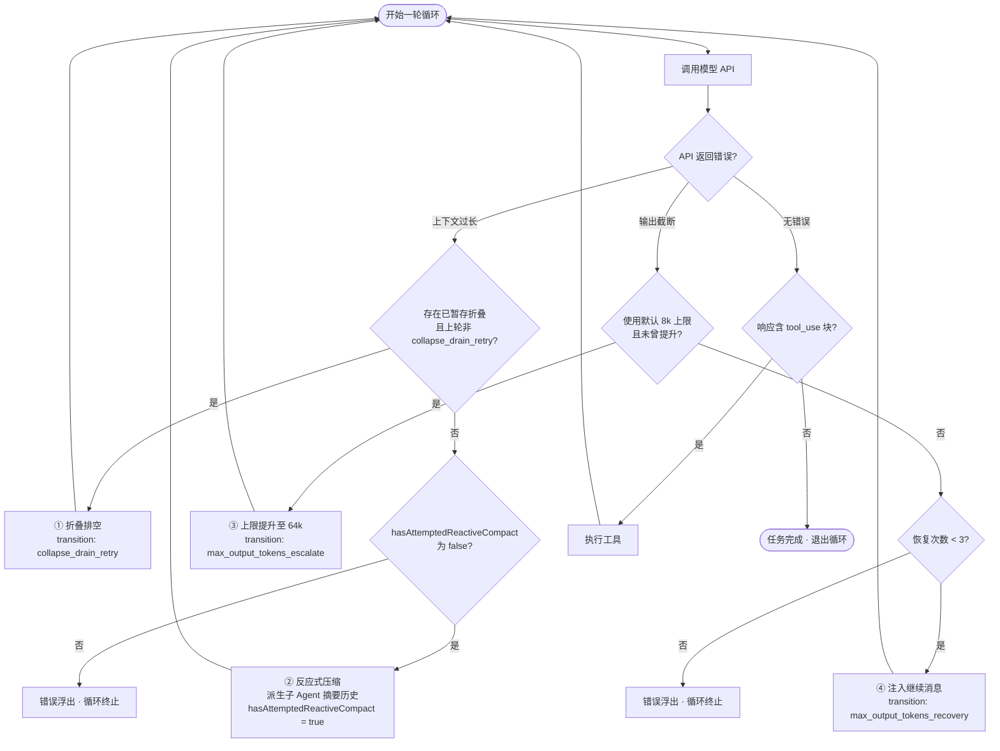

# 第7章 Query Loop：`hasAttemptedReactiveCompact` 为什么存在

2026 年 3 月 10 日，有人在 Claude Code 的代码库里加了一行常量：

```typescript
const MAX_CONSECUTIVE_AUTOCOMPACT_FAILURES = 3
```

注释里附了一段数据：

```
// BQ 2026-03-10: 1,279 sessions had 50+ consecutive failures (up to 3,272)
// in a single session, wasting ~250K API calls/day globally.
```

翻译一下：在这行代码加入之前，有 1,279 个会话在单次会话内连续失败了 50 次以上。最极端的一个会话失败了 3,272 次。全球每天因此浪费约 25 万次 API 调用。

这不是设计文档里的假设场景，是真实发生过的事故。`query.ts` 主循环里的每一个 flag、每一个上限，背后都有类似的故事。

## 7.1 最简单的循环为什么会失控

Agent 循环的最简形式是三行：调模型 → 执行工具 → 重复。这个循环在理想情况下能工作，但在真实环境里会遇到三类问题，而且每类问题的"修复"本身都可能制造新的无限循环。

**上下文过长。** 随着对话轮数增加，消息历史越来越长，最终超过模型的上下文窗口。如果不处理，API 调用失败，循环终止。如果处理（压缩历史），压缩后可能仍然过长，触发再次压缩，形成无限循环。

**输出被截断。** 模型的单次输出有 token 上限，长输出会被截断。如果不处理，用户得到不完整的输出。如果处理（注入"继续"消息），模型可能再次被截断，形成无限循环。

**API 调用失败。** 网络问题、速率限制、服务器错误都可能导致 API 调用失败。如果不处理，循环终止。如果处理（重试），重试次数没有上限时，循环可能永远不退出——就像那 3,272 次连续失败的会话。

`query.ts` 的主循环为每类问题都设计了有上限的恢复路径。理解这些路径，就是理解这个循环为什么长成现在这个样子。

## 7.2 `hasAttemptedReactiveCompact`：一个 flag 防止一类死循环

[`query.ts#L211`](https://github.com/xuhengzhi75/claude-code-source/blob/9e4d0c6d68748da4cc9623a89752ed2cf60af4ea/src/query.ts#L211) 声明了这个 flag，[`L282`](https://github.com/xuhengzhi75/claude-code-source/blob/9e4d0c6d68748da4cc9623a89752ed2cf60af4ea/src/query.ts#L282) 初始化为 `false`，[`L1166`](https://github.com/xuhengzhi75/claude-code-source/blob/9e4d0c6d68748da4cc9623a89752ed2cf60af4ea/src/query.ts#L1166) 在触发压缩后设为 `true`，之后不再重置。

[`L1089-L1090`](https://github.com/xuhengzhi75/claude-code-source/blob/9e4d0c6d68748da4cc9623a89752ed2cf60af4ea/src/query.ts#L1089-L1090) 的注释说得很直接：

```
// post-compact turn will media-error again; hasAttemptedReactiveCompact
// prevents a spiral and the error surfaces.
```

没有这个 flag 时，系统会陷入：上下文过长 → 触发压缩 → 压缩后仍然过长（因为保留段本身就很大）→ 再次触发压缩 → 无限循环。

`hasAttemptedReactiveCompact` 保证压缩只触发一次。如果压缩后仍然过长，错误会被 surface 出来，而不是继续循环。

这个设计有一个隐含假设：一次压缩足以解决上下文过长问题。如果用户的对话本身就包含大量不可压缩的内容（比如大量代码），一次压缩可能不够。这时系统选择报错，而不是继续压缩——因为继续压缩的代价是无限循环，报错的代价是用户看到一条错误消息。两害相权，报错更可控。

## 7.3 继续条件为什么不看 `stop_reason`

[`query.ts#L561-L565`](https://github.com/xuhengzhi75/claude-code-source/blob/9e4d0c6d68748da4cc9623a89752ed2cf60af4ea/src/query.ts#L561-L565) 有一段注释：

```typescript
// We intentionally derive "need another model turn" from observed tool_use
// blocks instead of stop_reason. This keeps behavior stable across provider/
// SDK differences where stop_reason may be missing or delayed in stream events.
```

`needsFollowUp` 由 `toolUseBlocks` 是否出现驱动，而不是 `stop_reason`。

`stop_reason` 是模型对自己行为的描述，不同 provider 和 SDK 对这个字段的语义不完全稳定，可能缺失或在流式事件中延迟到达。但 `tool_use` 块是否真的出现在响应里，是可以直接观察的事实。

相信"发生了什么"（可观察的事实），而不是相信"模型怎么描述自己停下来的原因"（模型的自我报告）。在跨 provider 的系统里，这个原则能减少因 provider 差异导致的行为不一致。

## 7.4 四条恢复路径的完整决策表

主循环里有四条恢复路径，按代价从小到大排列：



| 恢复路径 | 触发条件 | 行为 | 源码位置 |
|---------|---------|------|---------|
| 上下文折叠排空 | 上下文过长 + 存在已暂存的折叠 + 上一轮不是 `collapse_drain_retry` | 排空所有已暂存的上下文折叠并重试 | [`L1094-L1126`](https://github.com/xuhengzhi75/claude-code-source/blob/9e4d0c6d68748da4cc9623a89752ed2cf60af4ea/src/query.ts#L1094-L1126) |
| 反应式压缩 | 上下文过长或媒体过大 + `hasAttemptedReactiveCompact` 为 false | 派生压缩子 Agent 摘要历史，用摘要替换历史 | [`L1128-L1175`](https://github.com/xuhengzhi75/claude-code-source/blob/9e4d0c6d68748da4cc9623a89752ed2cf60af4ea/src/query.ts#L1128-L1175) |
| 输出上限提升 | 输出被截断 + 使用默认 8k 上限 + 未曾提升过 | 用 64k 上限重试同一请求 | [`L1197-L1230`](https://github.com/xuhengzhi75/claude-code-source/blob/9e4d0c6d68748da4cc9623a89752ed2cf60af4ea/src/query.ts#L1197-L1230) |
| 输出截断恢复 | 输出被截断 + 已提升上限 + 恢复次数 < 3 | 注入"继续输出"元消息，让模型从中途接续 | [`L1232-L1261`](https://github.com/xuhengzhi75/claude-code-source/blob/9e4d0c6d68748da4cc9623a89752ed2cf60af4ea/src/query.ts#L1232-L1261) |

`MAX_OUTPUT_TOKENS_RECOVERY_LIMIT = 3`（[`L164`](https://github.com/xuhengzhi75/claude-code-source/blob/9e4d0c6d68748da4cc9623a89752ed2cf60af4ea/src/query.ts#L164)）限制了恢复次数。超过 3 次后，错误会被 surface 出来。

四条路径的触发条件有重叠（上下文过长可以触发折叠排空，也可以触发反应式压缩），路径之间的优先级由代码顺序决定，而不是显式的优先级声明。这是一个技术债：如果未来需要调整优先级，需要修改代码顺序，而不是修改配置。

## 7.5 阈值从哪来：数据，不是直觉

压缩系统里有几个看起来像"拍脑袋"的数字，但每个都有数据来源。

`MAX_CONSECUTIVE_AUTOCOMPACT_FAILURES = 3` 来自那次 25 万次 API 调用浪费的事故。连续失败 3 次后停止重试，让错误 surface 出来。

**摘要预留 20,000 tokens**：基于历史观测中摘要长度的 p99.99，约为 17,387 tokens。预留 20,000 是在 p99.99 基础上加了约 15% 的安全边距。

**自动压缩触发点**：`context_window - max_output_tokens - 13,000 buffer`。13,000 的 buffer 是为了在触发压缩时，还有足够的空间完成当前轮次的输出，不至于在压缩过程中再次触发上下文过长错误。

**强制压缩触发点**（阻塞用户）：`context_window - max_output_tokens - 3,000 buffer`。3,000 是最后的安全线，到这里必须压缩，否则下一次 API 调用大概率失败。

自动压缩（13,000 buffer）是预防性的，给系统留出处理时间；强制压缩（3,000 buffer）是兜底的，到这里已经没有退路。两者之间的 10,000 token 窗口，是系统尝试自动压缩的空间。

熔断阈值应该来自真实的生产数据，而不是经验估算。用数据定阈值，比用直觉定阈值更难被质疑，也更容易在数据变化时调整。

## 7.6 `yieldMissingToolResultBlocks()`：针对 Capybara v8 的专项修复

在四条恢复路径之外，主循环还有一个更低调的防护机制：`yieldMissingToolResultBlocks()`。

Capybara v8（Claude Code 内部对某个模型版本的代号）有一个已知行为问题：在特定条件下，模型会产生 `tool_use` 块，但对应的 `tool_result` 块为空——即模型声称调用了工具，但没有返回任何结果。如果把这个空 `tool_result` 直接传给下一轮 API 调用，会触发 API 的格式校验错误，导致整个循环中断。

`yieldMissingToolResultBlocks()` 的作用是在每轮循环结束、构建下一轮消息之前，检查是否存在有 `tool_use` 但没有对应 `tool_result` 的情况，如果有，补充一个占位的 `tool_result` 块，让消息序列在格式上保持合法。

这是一个典型的"针对特定模型版本行为的补丁"。它不是通用的架构设计，而是对一个具体 bug 的具体修复。这类补丁在长期运行的系统里会积累，每一个都对应一段真实的故障历史。把这类补丁集中在消息构建层（而不是散落在业务逻辑里），可以让版本升级时的清理工作更容易定位。

## 7.7 `State` 的形状：为可测试性而设计的字段

[`query.ts#L206-L219`](https://github.com/xuhengzhi75/claude-code-source/blob/9e4d0c6d68748da4cc9623a89752ed2cf60af4ea/src/query.ts#L206-L219) 定义了 `State`，注释说明了设计意图：

```
// Mutable state carried between loop iterations. Keep this shape focused on
// runtime continuity concerns only: message evolution, compaction/recovery
// bookkeeping, and turn-to-turn transition cause.
```

`transition` 字段（[`L218`](https://github.com/xuhengzhi75/claude-code-source/blob/9e4d0c6d68748da4cc9623a89752ed2cf60af4ea/src/query.ts#L218)）记录了上一轮为什么继续，可能的值包括 `collapse_drain_retry`、`reactive_compact_retry`、`max_output_tokens_escalate`、`max_output_tokens_recovery`。

注释（[`L216-L218`](https://github.com/xuhengzhi75/claude-code-source/blob/9e4d0c6d68748da4cc9623a89752ed2cf60af4ea/src/query.ts#L216-L218)）说：

```
// Why the previous iteration continued. Undefined on first iteration.
// Lets tests assert recovery paths fired without inspecting message contents.
```

这个字段不是给用户看的，而是给测试用的——测试可以断言"这次循环走了 reactive_compact_retry 路径"，而不需要检查消息内容。在状态机里加入"上一次转换原因"字段，可以让测试直接断言状态机走了哪条路径，而不需要通过副作用（消息内容、日志）来推断。

## 7.8 输出截断时注入的元消息

[`L1233-L1238`](https://github.com/xuhengzhi75/claude-code-source/blob/9e4d0c6d68748da4cc9623a89752ed2cf60af4ea/src/query.ts#L1233-L1238) 里，当输出被截断时，系统注入这条消息：

```typescript
const recoveryMessage = createUserMessage({
  content:
    `Output token limit hit. Resume directly — no apology, no recap of what you were doing. ` +
    `Pick up mid-thought if that is where the cut happened. Break remaining work into smaller pieces.`,
  isMeta: true,
})
```

这条消息的措辞是精心设计的：不要道歉，不要回顾，直接继续，从中途接续。这是因为模型在恢复时有一个倾向：先道歉，再总结之前做了什么，然后才继续。这会浪费 token，而且在截断场景下没有意义。

`isMeta: true` 标记这条消息是系统注入的，不是用户输入的，不会显示在 UI 里。

## 7.9 心智模型验证题

如果去掉 `hasAttemptedReactiveCompact` 这个 flag，在什么情况下会出现无限循环？

答案：当压缩后的历史本身就超过上下文窗口时。比如，用户的对话包含大量代码，压缩后的摘要仍然很长，超过上下文窗口。没有这个 flag，系统会再次触发压缩，压缩后仍然过长，再次触发，形成无限循环，直到 API 调用次数耗尽或进程被杀死。

## 7.10 本章小结

`query.ts` 的主循环是一个防止无限循环的状态机。每个 flag 的存在都有一个真实的故障场景作为背书：`hasAttemptedReactiveCompact` 防止压缩触发死循环，`MAX_CONSECUTIVE_AUTOCOMPACT_FAILURES = 3` 来自 25 万次 API 调用浪费的事故，`needsFollowUp` 基于 `tool_use` 事实而非 `stop_reason` 判断是否继续，`transition` 字段为测试提供可断言的路径记录。

四条恢复路径按代价从小到大排列，每条路径都有明确的触发条件和终止保证。这个设计的核心原则是：每条恢复路径都必须有上限，否则循环就没有终止保证。
