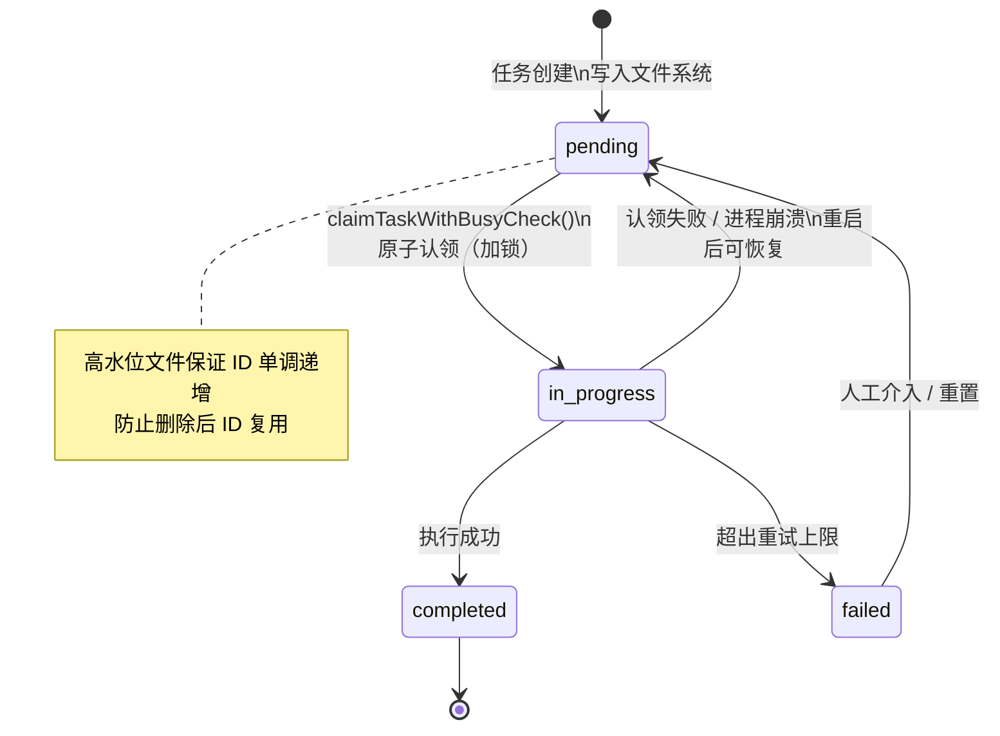
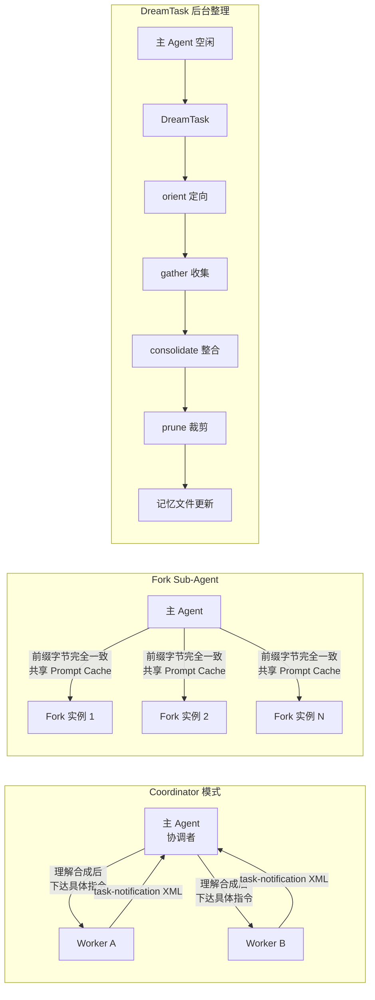

# 第8章 任务系统：对话循环承载不了的，由任务对象来承载

**核心主张（可被反驳）：** 任务对象化解决的不是并发速度，而是状态越过进程边界继续存活——这个决策决定了整套机制的文件、锁、ID 设计。

---

进程像餐厅的服务员：只要他站着，点单记在脑子里没问题；一旦下班，脑子里的内容消失。对话循环就是这个服务员——状态活在内存里，进程退出，状态归零。

这对问答没问题。对"重构 30 个文件、10 个 Agent 并行分析代码、中途崩溃重启"这类长任务，代价是 20 分钟工作全部归零。

任务系统要回答的第一性问题只有一个：**进程死了之后，任务在哪里？** 它不负责让 Agent 跑得更快，只负责让状态活得比进程更长。这两个方向决定了完全不同的设计选择。

---

## 8.1 状态离开内存：文件是有意识的取舍

把状态存到文件不是默认选项，是在可观测性和零依赖之间做出的显式选择。

[`tasks.ts#L76`](https://github.com/xuhengzhi75/claude-code-source/blob/f82ac18334ec9ca9890b9294ea8efa72773fa97c/src/utils/tasks.ts#L76) 定义了 `TaskSchema`：每个任务是一个 JSON 文件，路径是 `~/.claude/tasks/<taskListId>/<taskId>.json`。`owner` 字段记录认领该任务的 agent ID，`blocks`/`blockedBy` 字段构成任务依赖图，`status` 只有三态：`pending`/`in_progress`/`completed`。

替代方案是 SQLite 或 Redis。SQLite 提供事务语义和更强的一致性保证，但引入了依赖，也让"出问题直接 `cat` 文件"的调试路径消失。文件的优势恰好是这两点：零依赖，任务状态出问题时运维人员不需要特殊工具，直接读文件就能定位。这不是懒惰，是把"运维时可观测"和"安装时零摩擦"排在了"极端并发性能"前面。

文件系统的设计有一个显式边界：假设运行在本地文件系统上。NFS 挂载场景下，`proper-lockfile` 的锁语义无法保证——NFS 不可靠地实现 POSIX 锁，TOCTOU 竞态可能重新出现。这是已知的权衡，不是遗漏。



### 高水位文件：一个 1KB 文件守护整个 ID 单调性

只取"当前目录最大 ID + 1"分配新任务 ID 会静默损坏任务日志。场景：任务 1、2、3 存在，任务 3 完成被删除，当前最大 ID 变成 2，新任务被分配 ID 3，但历史日志里 ID 3 指向旧任务。排查时日志对不上，没有报错，只有困惑。

[`tasks.ts#L92`](https://github.com/xuhengzhi75/claude-code-source/blob/f82ac18334ec9ca9890b9294ea8efa72773fa97c/src/utils/tasks.ts#L92) 的 `.highwatermark` 文件记录已分配过的最大任务 ID，无论中间发生过什么删除操作，ID 保持单调递增。`resetTaskList` 和 `deleteTask` 在操作时都更新高水位，同一个锚点保护整个依赖图的 ID 完整性。

---

## 8.2 原子认领：两种锁粒度各司其职

并发正确性的问题不是"锁不锁"，而是"哪些步骤必须在同一把锁里"。

[`tasks.ts#L621`](https://github.com/xuhengzhi75/claude-code-source/blob/f82ac18334ec9ca9890b9294ea8efa72773fa97c/src/utils/tasks.ts#L621) 的 `claimTaskWithBusyCheck()` 注释说得直接：

```
// 关键一致性点：把"检查 agent 是否繁忙"与"抢占任务"放进同一把 list-level 锁。
// 这是典型的 check-then-act 场景，分离会导致 TOCTOU 竞争
// （两个 agent 同时看到空闲并同时认领）。
```

TOCTOU（time-of-check to time-of-use）竞态：Agent A 检查任务 T 未被认领，Agent B 同时也检查 T 未被认领，两者都成功认领，同一个任务被执行两遍。把检查和认领放在同一把锁内，这两步变成原子操作，竞态窗口消失。

锁参数有工程依据，来自 [`tasks.ts#L94-L108`](https://github.com/xuhengzhi75/claude-code-source/blob/f82ac18334ec9ca9890b9294ea8efa72773fa97c/src/utils/tasks.ts#L94-L108)：

```typescript
// Budget sized for ~10+ concurrent swarm agents: each critical section does
// readdir + N×readFile + writeFile (~50-100ms on slow disks), so the last
// caller in a 10-way race needs ~900ms. retries=30 gives ~2.6s total wait.
const LOCK_OPTIONS = {
  retries: { retries: 30, minTimeout: 5, maxTimeout: 100 },
}
```

`retries: 30` 是按 10 个并发 agent 的 swarm 场景估算出来的，不是随意填的数字。超过这个量级，锁等待时间线性增长，这是当前实现的已知上限。

代码区分了两种锁粒度：`updateTask` 用 task-level lock（更新单个任务），`claimTaskWithBusyCheck` 用 list-level lock（需要原子读全局状态再更新）。粗的不够细，细的不够全，两种粒度都存在是因为两类操作的一致性需求确实不同。

### 崩溃归还依赖幂等假设

`unassignTeammateTasks` 在检测到 teammate 退出时，把该 agent 持有的所有 `in_progress` 任务归还为 `pending`，等待其他 agent 重新认领。这防止了任务因进程崩溃永久卡住。

这个机制有一个隐含前提：任务是幂等的，重新从头执行不会产生副作用。如果任务包含非幂等的外部操作（写数据库、发邮件），归还后重新认领会产生重复执行。当前设计不解决这个问题，这是已知的边界条件，需要上层应用自己处理。

---

## 8.3 三种任务模式：共享状态机，分工不同

Fork Sub-Agent、Coordinator 模式、DreamTask 三者都在同一套文件状态机上运行，但各自解决不同的问题。



### Fork Sub-Agent：字节一致前缀才能命中缓存

Fork Sub-Agent 直接继承主 Agent 的对话历史和系统提示，省去上下文传递。这个设计的工程意图来自 `tools/AgentTool/forkSubagent.ts` 的注释：

> "For prompt cache sharing, all fork children must produce byte-identical API request prefixes."

所有 Fork 实例的前缀消息被刻意设计成字节完全一致，只有最后一段指令不同。API 服务器缓存前面的大段内容，只计算最后的差异部分。并行克隆 10 个实例时，缓存命中后 API 成本远低于 10 倍线性叠加。

子实例的指令格式有严格约束：必须以 `Scope:` 开头声明工作范围，禁止再克隆子 Agent（防止嵌套爆炸），禁止提问（直接行动）。这套约束同时服务两个目标：保证前缀字节一致（缓存命中），和限制子实例行为边界（不越界）。

### Coordinator 模式：理解合成的责任在协调者

Coordinator 模式通过环境变量 `CLAUDE_CODE_COORDINATOR_MODE=1` 激活。主 Agent 转变为纯协调者，职责是：下达任务、接收汇报（`<task-notification>` XML 格式）、综合信息决定下一步。

Coordinator 最容易犯的错误是把研究 Agent 的结论原文转发给执行 Agent：

```
// 错误：让执行 Agent 自己理解"auth bug"是什么
AgentTool({ prompt: "Based on your findings, fix the auth bug" })

// 正确：Coordinator 先理解，再给出确定性指令
AgentTool({ prompt: "Fix the null pointer in src/auth/validate.ts:42.
  The user field on Session is undefined when sessions expire but the token
  remains cached. Add a null check before user.id access — if null, return 401." })
```

两者的差别不只是信息量，而是责任归属。前者把理解工作推给执行 Agent，结果不可预测。后者把理解工作留在 Coordinator，执行 Agent 只做确定的事。源码注释的原话：

> "Parallelism is your superpower. Workers are async. Launch independent workers concurrently whenever possible."

### DreamTask：后台记忆整理对调用方透明

DreamTask 是主 Agent 空闲时在后台运行的特殊任务，负责记忆整理（Memory Consolidation，指将对话历史中的关键信息提炼并持久化到记忆文件）。来自 `tasks/DreamTask/DreamTask.ts`，内部分四阶段：orient（定向）→ gather（收集）→ consolidate（整合）→ prune（裁剪）。对外只暴露"开始"和"更新中"两种状态，内部阶段对调用方透明。

记忆整理是计算密集型操作，放在主流程会阻塞用户交互，放在后台则完全无感，代价是整理结果有延迟，不是实时可用的。这个取舍在代码里是显式的。

主循环与任务系统的接缝是隐式的：`src/query.ts#L1584` 处理 `task-notification`，`query.ts#L1694` 在 `BG_SESSIONS` 下生成 task summary。没有显式的接口声明，需要读代码才能找全。任务系统接口变化时，必须逐一找到这些隐式接缝点修改。

---

## 8.4 边界与可迁移原则

当前任务系统有两个已知的失效条件。

文件锁在 NFS 上不可靠。如果部署环境是 NFS 挂载，`proper-lockfile` 的锁语义无法保证，TOCTOU 竞态可能重新出现。这不是 bug，是设计假设边界：系统假设运行在本地文件系统上。

任务 ID 分配依赖单文件串行写入。高水位文件是单点，当前实现为 10+ 个并发 agent 的 swarm 场景设计。超出这个量级时，锁等待时间线性增长。

从这套设计可以提取一条可迁移的原则：**需要原子性保护的是"认领动作"，不是"执行动作"。** 检查可用性和完成认领必须在同一把锁里，执行本身可以在锁外进行。

适用条件：有多个执行体竞争认领任务，且每个任务只应被执行一次。

反例：系统是单执行体的，不存在并发竞争时，原子认领的复杂性没有收益，直接取任务执行。原则是工具，不是教条。

---

## 8.5 本章不覆盖项

本章不覆盖 query loop 内部的任务推进逻辑（见第7章），也不覆盖任务执行中断后的对话恢复机制（见第10章）。任务对象化解决"状态在哪里"，恢复机制解决"上下文怎么续上"，两者是独立的问题。

**心智模型验证：** 一个 Agent 在执行任务到第 3 步时进程崩溃，重启后系统怎么知道从哪里继续？任务状态（已在文件系统）告诉它任务在哪、处于哪个状态；对话恢复机制（第10章）告诉它上下文是什么。如果任务是非幂等的（写数据库已完成），重新认领并从头执行会产生重复副作用——这是当前设计的已知未解问题。
