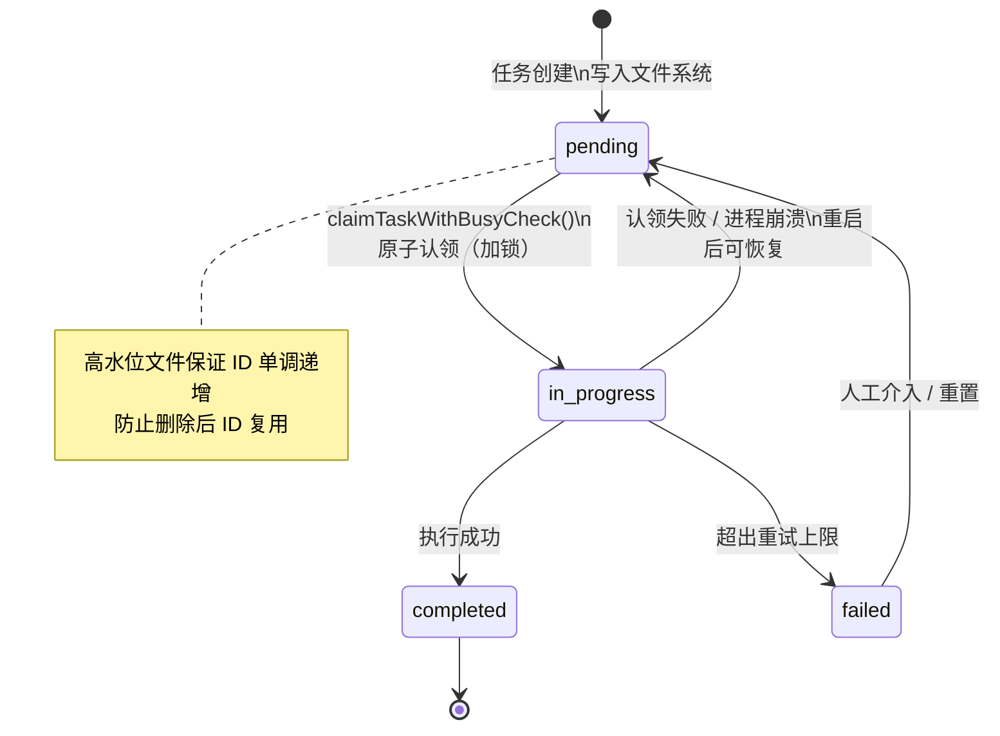
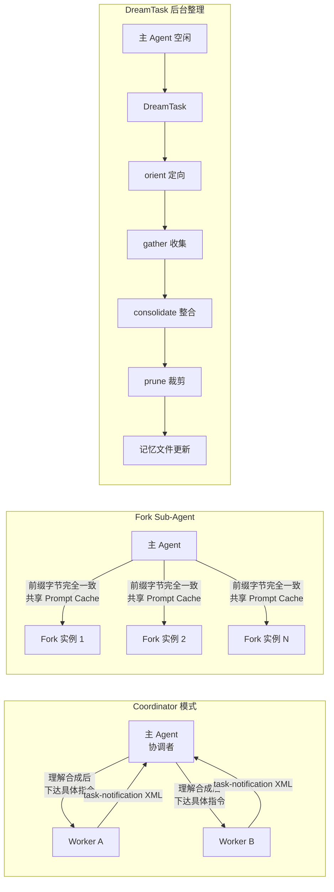

# 第8章 任务系统：对话循环承载不了的，由任务对象来承载

**核心主张（可被反驳）：** 任务对象化的价值不是让 Agent 能并发，而是让状态在进程边界之外继续存在——没有这一步，所谓的多 Agent 协作只是同进程内的函数调用分拆。

## 8.1 第一性问题：对话循环为什么不够

对话循环能解决"这一轮怎么继续"，但它有一个根本限制：状态活在进程内存里。进程退出，状态消失。

对于问答场景，这不是问题。对于长任务——重构 30 个文件、并行跑 10 个 Agent 分析代码——这个限制会在最不合时宜的时刻暴露。20 分钟的工作，进程崩溃，全部归零。

任务系统要解决的不是"怎么跑更快"，而是"进程死了之后任务在哪里"。这两个问题决定了完全不同的设计方向。

## 8.2 状态从内存提升到文件系统

[`tasks.ts#L76`](https://github.com/xuhengzhi75/claude-code-source/blob/f82ac18334ec9ca9890b9294ea8efa72773fa97c/src/utils/tasks.ts#L76) 定义了 `TaskSchema`：每个任务是一个 JSON 文件，存在 `~/.claude/tasks/<taskListId>/<taskId>.json`。`owner` 字段记录认领该任务的 agent ID，`blocks`/`blockedBy` 记录任务依赖图，`status` 是 `pending`/`in_progress`/`completed` 三态。

这个设计有一个显式的隐含假设：文件系统是可靠的持久化介质。在单机环境下，这个假设成立。在 NFS 挂载或多机共享的场景下，文件锁行为不一致（NFS 不可靠地实现 POSIX 锁），任务系统会出现并发 bug。这不是遗漏，是有意识的权衡：单机场景够用，分布式场景需要换存储。

替代方案是用 SQLite 或 Redis。SQLite 能提供事务语义和更强的一致性保证，但引入了依赖，也让"出了问题直接 `cat` 文件"的调试体验消失。文件的优势恰恰是零依赖和可观测——任务状态出问题时，运维人员不需要特殊工具，直接读文件就能定位。



## 8.3 高水位文件：一个 flag 防止日志错乱

[`tasks.ts#L92`](https://github.com/xuhengzhi75/claude-code-source/blob/f82ac18334ec9ca9890b9294ea8efa72773fa97c/src/utils/tasks.ts#L92) 维护了一个 `.highwatermark` 文件，记录已分配过的最大任务 ID。

不用这个文件、只取"当前最大 ID + 1"会出什么问题：任务 1、2、3 存在，任务 3 完成被删除，当前最大 ID 变成 2，新任务被分配 ID 3，但历史日志里 ID 3 指向的是旧任务。任务和日志的对应关系静默损坏，没有报错，只有排查时对不上号。

高水位文件保证 ID 单调递增，无论中间发生过什么删除操作。这是一个 1KB 的文本文件，但它保护的是整个任务依赖图的完整性（[`resetTaskList`、`deleteTask` 在操作时都更新高水位](https://github.com/xuhengzhi75/claude-code-source/blob/f82ac18334ec9ca9890b9294ea8efa72773fa97c/src/utils/tasks.ts#L92)）。

## 8.4 原子认领：检查和认领必须在同一把锁里

[`tasks.ts#L621`](https://github.com/xuhengzhi75/claude-code-source/blob/f82ac18334ec9ca9890b9294ea8efa72773fa97c/src/utils/tasks.ts#L621) 的 `claimTaskWithBusyCheck()` 注释写得直接：

```
// 关键一致性点：把"检查 agent 是否繁忙"与"抢占任务"放进同一把 list-level 锁。
// 这是典型的 check-then-act 场景，分离会导致 TOCTOU 竞争
// （两个 agent 同时看到空闲并同时认领）。
```

TOCTOU（time-of-check to time-of-use）竞态：Agent A 检查任务 T 未被认领，Agent B 同时也检查 T 未被认领，两者都成功认领，同一个任务被执行两遍。

把检查和认领放在同一把锁内，这两步就变成原子的。锁参数同样有来历（[`tasks.ts#L94-L108`](https://github.com/xuhengzhi75/claude-code-source/blob/f82ac18334ec9ca9890b9294ea8efa72773fa97c/src/utils/tasks.ts#L94-L108)）：

```typescript
// Budget sized for ~10+ concurrent swarm agents: each critical section does
// readdir + N×readFile + writeFile (~50-100ms on slow disks), so the last
// caller in a 10-way race needs ~900ms. retries=30 gives ~2.6s total wait.
const LOCK_OPTIONS = {
  retries: { retries: 30, minTimeout: 5, maxTimeout: 100 },
}
```

`retries: 30` 是根据 10 个并发 agent 的 swarm 场景估算的，不是随意的数字。

代码里还区分了两种锁粒度：`updateTask` 用 task-level lock（更新单个任务），`claimTaskWithBusyCheck` 用 list-level lock（需要原子看全局再更新）。两种粒度都有，粗的不够细，细的不够全，真实系统里两种都需要。

## 8.5 崩溃后任务归还：进程退出不等于任务丢失

teammate 崩溃或退出后，其持有的任务不会卡在 `in_progress` 状态永久等待。[`unassignTeammateTasks`](https://github.com/xuhengzhi75/claude-code-source/blob/f82ac18334ec9ca9890b9294ea8efa72773fa97c/src/utils/tasks.ts) 在检测到 teammate 退出时，把该 agent 持有的所有任务归还为 `pending`，等待其他 agent 认领。

这个机制的隐含假设是：任务是幂等的，重新执行一遍不会产生副作用。如果任务有非幂等的外部操作（写数据库、发邮件），归还后重新认领会产生重复执行的问题。当前设计没有解决这个问题，是已知的边界条件。

## 8.6 主循环与任务系统的接缝

任务系统不是完全绕开主循环独立运行的。`src/query.ts#L1584` 里有 `task-notification` 处理，`query.ts#L1694` 里有 `BG_SESSIONS` 下的 task summary 生成。

这些接缝是隐式的——没有显式的接口声明，需要读代码才能找全。任务系统接口如果变化，必须找到所有隐式接缝点逐一修改，接口变更的成本散落在代码里，不在文档里。



## 8.7 Fork Sub-Agent：前缀字节完全一致才能共享缓存

普通 Sub-Agent 从零开始，主 Agent 需要传递完整背景。Fork Sub-Agent 直接继承主 Agent 的对话历史和系统提示，省去上下文传递。

Fork 机制有一个更深的工程意图，来自 `tools/AgentTool/forkSubagent.ts` 的注释：

> "For prompt cache sharing, all fork children must produce byte-identical API request prefixes."

所有 Fork 实例的前缀消息被刻意设计成字节完全一致，只有最后一段指令不同。API 服务器缓存前面的大段内容，只计算最后的差异部分。并行克隆 10 个实例，缓存命中后 API 成本远低于 10 倍。

子实例的指令格式有严格约束：必须以 `Scope:` 开头声明工作范围，禁止再克隆子 Agent（防止嵌套爆炸），禁止提问（直接行动）。这套约束同时服务于两个目标：保证前缀字节一致（缓存命中），和限制子实例行为边界（不越界）。

## 8.8 Coordinator 模式：理解合成，而非转发

Coordinator 模式通过环境变量 `CLAUDE_CODE_COORDINATOR_MODE=1` 激活。主 Agent 转变为纯协调者，只做三件事：下达任务、接收汇报（`<task-notification>` XML 格式）、综合信息决定下一步。

源码注释的原话：

> "Parallelism is your superpower. Workers are async. Launch independent workers concurrently whenever possible."

Coordinator 最容易犯的错误是直接把研究 Agent 的结论转发给执行 Agent：

```
// 反模式：懒惰的委托
AgentTool({ prompt: "Based on your findings, fix the auth bug" })

// 正确：经过理解合成的指令
AgentTool({ prompt: "Fix the null pointer in src/auth/validate.ts:42.
  The user field on Session is undefined when sessions expire but the token
  remains cached. Add a null check before user.id access — if null, return 401." })
```

两者的差别不只是信息量，而是责任归属。前者让执行 Agent 自己去理解"auth bug"是什么，执行结果不可预测。后者把理解工作放在 Coordinator，执行 Agent 只做确定的事。

## 8.9 DreamTask：后台记忆整理的四阶段流水线

DreamTask 是在主 Agent 空闲时在后台运行的特殊任务，负责记忆整理（Memory Consolidation）。来自 `tasks/DreamTask/DreamTask.ts`，内部分四阶段：orient（定向）→ gather（收集）→ consolidate（整合）→ prune（裁剪）。对外只暴露"开始"和"更新中"两种状态，内部阶段对调用方透明。

设计权衡很直白：记忆整理是计算密集型操作，放在主流程会阻塞用户交互，放在后台则完全无感，代价是整理结果有延迟，不是实时可用的。

## 8.10 边界与技术债

当前任务系统有两个已知的边界条件：

文件锁在 NFS 上不可靠。如果部署环境是 NFS 挂载，`proper-lockfile` 的锁语义无法保证，TOCTOU 竞态可能重新出现。任务系统假设运行在本地文件系统上。

任务 ID 分配依赖单文件串行写入。高水位文件是单点，极高并发下会成为瓶颈。当前实现为 10+ 个并发 agent 的 swarm 场景设计，超出这个量级时，锁等待时间会线性增长。

## 8.11 可迁移原则

从这套设计中可以提取一条可迁移的原则：副作用操作需要先确定范围，再进行认领，认领和范围检查必须在同一个原子操作里完成。

适用条件：有多个执行体竞争认领任务，且每个任务只应被执行一次。

反例：如果系统是单执行体的，不存在并发竞争，原子认领的复杂性没有收益，直接取任务执行即可。

## 8.12 本章不覆盖项

本章不覆盖 query loop 内部的任务推进逻辑（见第7章），也不覆盖任务执行中断后的对话恢复机制（见第10章）。任务对象化解决"状态在哪里"，恢复机制解决"上下文怎么续上"，两者是独立的问题。

**心智模型验证：** 一个 Agent 在执行任务到第 3 步时进程崩溃，重启后系统怎么知道从哪里继续？任务状态（已在文件系统）告诉它任务在哪、做到哪一步，对话恢复机制（第10章）告诉它上下文是什么。两套机制分工清晰，互不依赖。如果任务是非幂等的（写数据库已完成），重新认领并从头执行会产生重复副作用，这是当前设计没有解决的问题。
