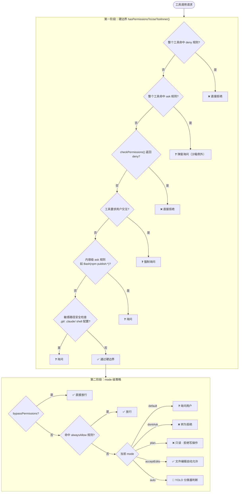
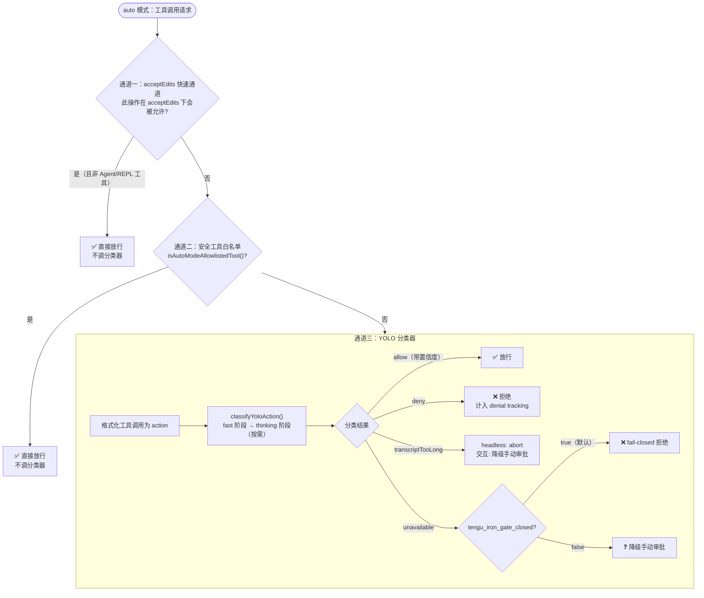

# 第二十章：权限系统

Claude Code 的权限系统不是一个开关，是一条流水线。

理解这一点，比背诵六种 PermissionMode 的名字重要得多。

## 权限分两步走，绕不过第一步

权限决策的总入口是 `hasPermissionsToUseTool`（`src/utils/permissions/permissions.ts#L477`）。

从外面看，它返回一个"允许/询问/拒绝"的决策。从里面看，它把决策过程切成了两个阶段，中间有一道明确的边界。

**第一阶段**由内层函数 `hasPermissionsToUseToolInner` 负责（`L1066-L1164`），处理的是"硬边界"——无论用户选了哪种 mode，这些检查都会执行，都无法绕过：

- 整个工具被 deny 规则命中 → 直接拒绝
- 整个工具被 ask 规则命中 → 弹窗询问（沙箱环境例外）
- 工具的 `checkPermissions()` 返回 deny → 直接拒绝
- 工具要求用户交互 → 强制询问
- 内容级 ask 规则（如 `Bash(npm publish:*)`）→ 询问
- 安全检查（`.git/`、`.claude/`、shell 配置文件等敏感路径）→ 询问

**第二阶段**在外层处理，只对通过了第一阶段的请求生效。到了这里，mode 才开始起作用：`bypassPermissions` 直接放行，`alwaysAllow` 规则也在这里匹配，剩下的请求转入 mode 级策略（询问、dontAsk 转拒绝、auto 模式分类器）。

代码注释在 `L1270-L1272` 里直接写出了这个设计意图：

> 2a. mode 级治理边界：仅在通过前置硬边界后，才允许 bypass 生效。关键含义：bypassPermissions 不是"无条件放行"，前面的 deny/ask/safety 仍可拦截。

这句注释值得记住。`bypassPermissions` 模式跳过的是 mode 级审批，不是安全检查。用户无法用 bypass 绕过 `.git/` 写保护，也无法绕过 `npm publish` 询问。



## 六种模式，各有各的脾气

权限系统支持六种 PermissionMode（`src/types/permissions.ts#L16-L36`）：

| Mode | 行为 |
|---|---|
| `default` | 遇到未授权操作就询问用户 |
| `acceptEdits` | 文件编辑类操作自动允许，其他仍然询问 |
| `plan` | 只读，不执行写操作 |
| `bypassPermissions` | 跳过大多数权限检查（仍受硬边界约束） |
| `dontAsk` | 把所有询问转成拒绝，不弹窗 |
| `auto` | 用 AI 分类器替代人工审批 |

最后一个 `auto` 模式需要额外说明：它只在 `feature('TRANSCRIPT_CLASSIFIER')` 为 true 时才对用户可见，是 Anthropic 内部的实验性功能，外部版本目前不开放。

还有两个不对外暴露的 mode：`bubble`（内部传播用）和对应内部角色的若干变体。

## 能抄近路就不麻烦分类器

auto 模式的设计目标是"用 AI 分类器替代人工审批"，但调用分类器有成本，所以它在分类器前面设了三条快速通道，按成本从低到高依次尝试（`L597-L932`）：

**通道一：acceptEdits 快速通道**（`L597-L660`）

如果当前操作在 acceptEdits 模式下会被允许，直接放行，不调分类器。

但有例外：Agent 类工具和 REPL 工具被排除在外——这两个工具的 `checkPermissions` 在 acceptEdits 下返回 allow，但实际上可能包含危险操作，不能走快速通道。

**通道二：安全工具白名单**（`L662-L690`）

`isAutoModeAllowlistedTool()` 维护了一个已知安全工具的名单。命中则直接放行，不调分类器。

**通道三：YOLO 分类器**（`L692-L932`）

前两条通道都没有放行，则把工具调用格式化成 action，交给 `classifyYoloAction()`。分类器有两阶段：fast 和 thinking，结果带置信度和阶段信息。

分类器失败有两种处理路径：
- `transcriptTooLong`（上下文超限）：确定性错误，headless 模式直接 abort，交互模式降级为手动审批
- `unavailable`（API 错误）：由 `tengu_iron_gate_closed` feature gate 控制——默认 true 意味着 fail-closed（拒绝），也可配置为降级到手动审批



## 拒绝太多，Agent 就罢工了

auto 模式引入了一个新问题：如果分类器反复拒绝同一类操作，Agent 会陷入死循环——每次尝试都被拒绝，但不知道该怎么办。

解法是 denial tracking（`src/utils/permissions/denialTracking.ts`）。系统维护两个计数器：

- `consecutiveDenials`：连续拒绝次数，上限 **3 次**
- `totalDenials`：累计拒绝次数，上限 **20 次**

任何一个计数器触顶，自动升级为人工审批（交互模式）或 abort（headless 模式）。

任何一次成功的工具调用都会把 `consecutiveDenials` 归零。`totalDenials` 不重置——它是会话级的累计，记录的是整个任务里分类器的"判错次数"。

## Anthropic 留了两个远程断闸

Anthropic 保留了两个可以远程收紧权限的开关（`src/utils/permissions/bypassPermissionsKillswitch.ts`）：

**bypass killswitch**：当 Statsig gate `shouldDisableBypassPermissions()` 返回 true，`bypassPermissions` 模式对用户不可用。检查只在每次 query 开始前跑一次，`/login` 后重置。

**auto mode killswitch**：`verifyAutoModeGateAccess()` 同时检查 GrowthBook gate、模型能力和 fastMode breaker。检查不合格则把 mode 强制降级，并推送 warning 通知。

这里有一个值得记的实现细节：killswitch 检查是异步的，检查完成后用函数式更新写回状态：

```typescript
setAppState(prev => updateContext(prev.toolPermissionContext))
```

这个模式——用 `prev => f(prev)` 而不是直接赋值——防止了异步竞态：如果用户在检查期间切换了 mode，函数式更新读的是当时的最新状态，而不是发起检查时的快照。

## 三句话记住整套权限逻辑

Claude Code 权限系统的架构决策可以用三句话概括：

第一，**两阶段分离**：硬边界（安全检查、deny 规则）和 mode 策略（bypass、auto、dontAsk）是两层，前者无法被后者绕过。

第二，**auto 模式是"先便宜后昂贵"**：acceptEdits 快速通道 → 白名单 → 分类器，成本依次递增，能短路就短路。

第三，**fail-closed 是默认倾向**：分类器报错 → 拒绝；计数器触顶 → 人工介入或 abort。系统的默认立场是"拒绝比放行更安全"。

---

> **验证题**：在 `bypassPermissions` mode 下，用户能否绕过 `.git/config` 的写保护？查找 `hasPermissionsToUseToolInner` 中关于安全路径的检查步骤（1g），确认它在 bypass 之前还是之后执行。
